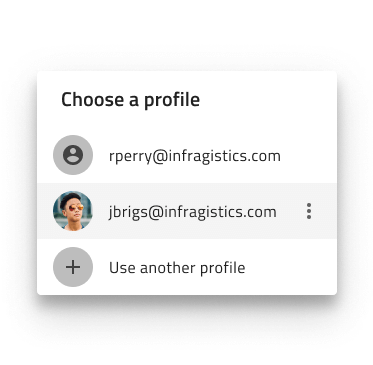

# Dialogs (ダイアログ)

Dialog パターンを使用して、ユーザーに警告するか、緊急の入力/アクションを必要とするエラーまたはシステム状態に関連する情報をユーザーに提供します。これらは通常、ユーザーのアクションによってトリガーされ、メイン コンテンツの上に表示される必要があります。Dialogs は、ユーザーの製品体験を妨げる可能性があるため、慎重に使用する必要があります。

Dialog パターンには、レイアウトを構成する Button、Input、Switch および List 要素によって提供されるスタイルの柔軟性があります。

## その他のリソース

関連トピック:

- [Button](../components/button.md)
- [Input](../components/input.md)
- [Switch](../components/switch.md)
- [List](../components/list.md)
  

コミュニティに参加して新しいアイデアをご提案ください。
