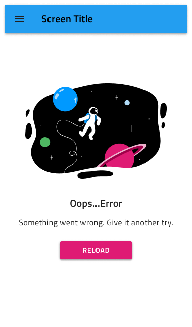

# Empty States

Use the Empty State Patterns to tell the user that there is no content to show due to a system error or when there are no results to be displayed e.g. when a filter is applied. Use them to encourage your users to interact with the product and avoid designs without any type of guidance or exact explanation as they confuse users and prevent them from using the product.

The Empty State Patterns come with the styling flexibility provided by the Navbar, Illustration, and Button that constitute their layout.

> [!WARNING]
> After inserting an Empty State Pattern, you should trigger `Detach from Symbol` in order to be able to generate it as Angular code. Illustrations nested inside the Pattern cannot be code generated and the Illustration itself has to be inserted manually after that step. Individual Components must stay intact and not be detached!

## Additional Resources

Related topics:

- [Illustrations](../style/illustrations.md)
- [Button](../components/button.md)
- [Navbar](../components/navbar.md)
  

Our community is active and always welcoming to new ideas.
