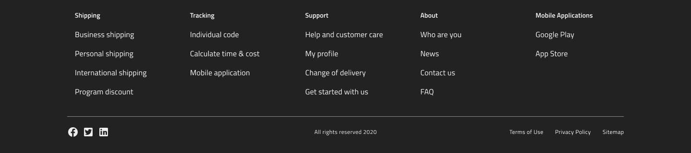
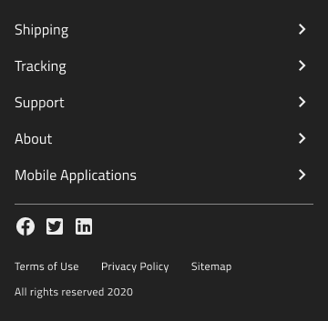
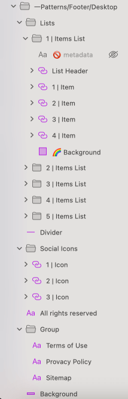

# Footers (フッター)

Footer パターンを使用して、サイト ページ、プライバシー ポリシー、利用規約、ソーシャル メディア リンク、サブスクリプション フォームなど、Web サイトの補足コンテンツを目立たない一貫した方法で表示します。そのコンテンツは、垂直方向または水平方向にレイアウトでき、ページの下部に配置されます。デスクトップおよびモバイル デバイスの画面サイズに適した Footer パターンが提供されています。

> [!WARNING]
> Footer パターンを挿入した後、パターンを Angular コードとして生成するには、`Detach from Symbol` をトリガーします。含まれるコンポーネントをデタッチしないでください。

## その他のリソース

関連トピック:

- [List](../components/list.md)
- [Icon](../components/icon.md)
  

コミュニティに参加して新しいアイデアをご提案ください。
