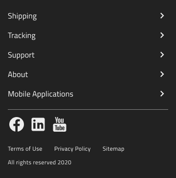

# Footers (フッター)

Footer パターンを使用して、サイト ページ、プライバシー ポリシー、利用規約、ソーシャル メディア リンク、サブスクリプション フォームなど、Web サイトの補足コンテンツを目立たない一貫した方法で表示します。そのコンテンツは、垂直方向または水平方向にレイアウトでき、ページの下部に配置されます。デスクトップおよびモバイル デバイスの画面サイズに適した Footer パターンが提供されています。

## その他のリソース

関連トピック:

- [Button](../components/button.md)
- [Divider](../components/divider.md)
- [List](../components/list.md)
- [Icon](../components/icon.md)
  

コミュニティに参加して新しいアイデアをご提案ください。
