---
title: Form - デザイン システム パターン
_description: Form パターン シンボルは様々なデータ入力および表示要素を含みます。
_keywords: デザイン システム, デザイン システム UX, UI キット, Sketch, Ignite UI for Angular, Sketch to Angular, Angular, Angular デザイン システム, Sketch からコードをエクスポート, Angular 用のデザイン キット, Sketch HTML, Sketch to HTML, Sketch UI キット
_language: ja
---

# Forms (フォーム)

Form パターンを使用すると、複数のユーザー入力が必要なアプリケーション シナリオを実装できます。全般的なフォームでデータ入力および表示コンポーネントが使用されます。

Form パターンは Login and Registration (ログインと登録)、Booking (予約)、Address (アドレス)、Payment (支払)、Contacts (連絡先)、Feedback (フィードバック)、Search (検索)、Shipping (配送)、Subscription (サブスクリプション)、Authentication (認証) および New (新規) など、コンテンツを追加するための全般的なシナリオのフォームを提供します。このフォームのレイアウトに含まれる Input、Checkbox、Radio Group、Button および Hyperlink のスタイル設定を使用できます。

## Log In、Registration、Authentication フォーム

Log In フォームは簡易なコンテンツおよび操作を持つレイアウトがあり、またはより複雑なレイアウトと追加の操作を持つソーシャル ログイン フォームがあります。

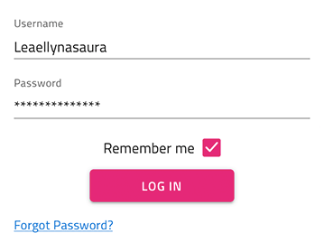
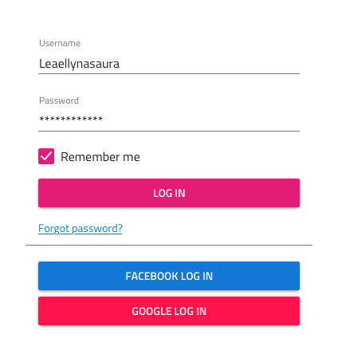
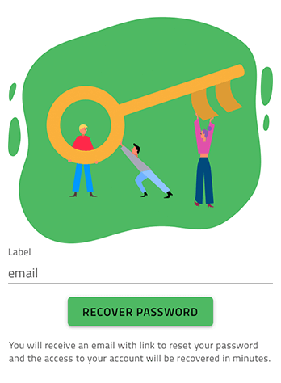
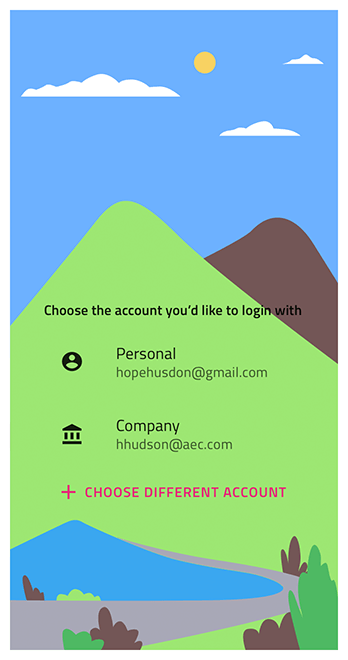

Registration フォームは簡易なコンテンツおよび操作を持つレイアウトがあり、またはより複雑なレイアウトと追加の操作を持つソーシャル メディア プロファイルの Registration フォームがあります。

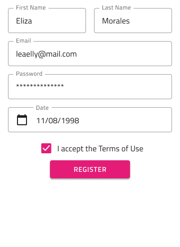
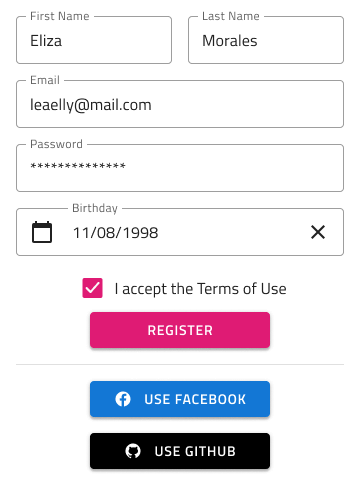

Log In フォームにも水平レイアウトがあり、レイアウトの Button および Hyperlink コンテンツを更新した後に登録フォームをカスタマイズして表示できます。このレイアウトは幅が広い画面に最適です。フォームがその他のコンテンツとインラインに表示されます。

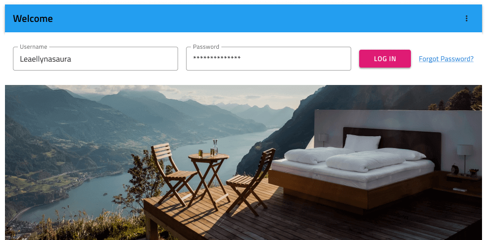

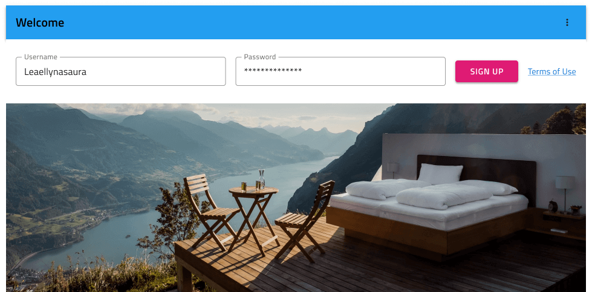

## Booking フォーム

Booking フォームプリセットが 4 つあり、Dates + People は一般的なフォームです。Dates + People + Rooms はホテルの予約に使用できます。Airports + Dates + People は飛行機のチケットやその他の乗車券の予約に使用できます。Location + People + Rooms もホテル予約に使用できます。

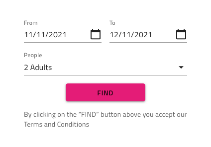
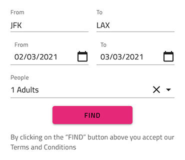

## New フォーム

New フォームが 2 種類があります。Budget は新しい予算の作成のための情報フォーム、Expense は新しい経費の作成のための情報フォームです。

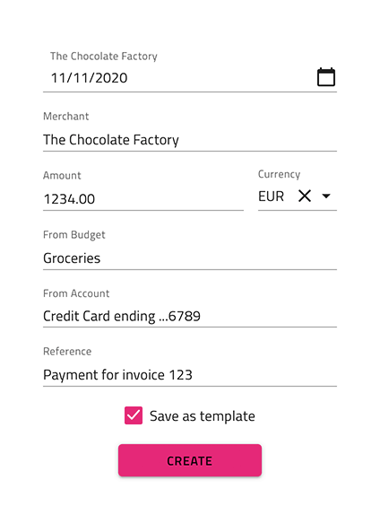

## E-commerce (e コマース) フォーム

Address (住所) フォーム、Size Selection (サイズ選択) フォーム、Simple (シンプル) および Advanced Search (高度な検索) フォーム、Shipping (配送) フォーム、およびいくつかのタイプの Payment (支払) フォームがあります。オンライン バンキングを介して送金する場合のように、Card (カード) 支払い用 と Transfer (転送用) があります。転送フォームは 4 つのレイアウトを提供します。Currency Exchange は為替換算のフィールドを含みます。Donation はチャリティに使用できるフォームです。Between Accounts は同じ銀行の複数アカウント間の送金に使用できます。Between Banks は他銀行への送金に使用できます。

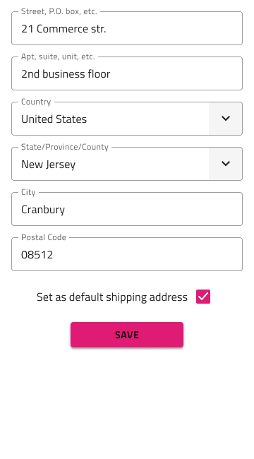
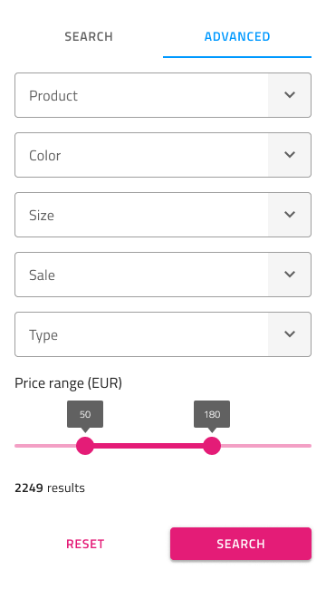
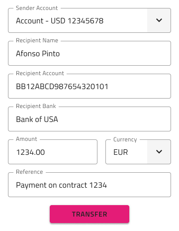
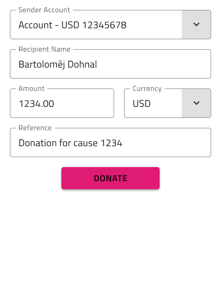
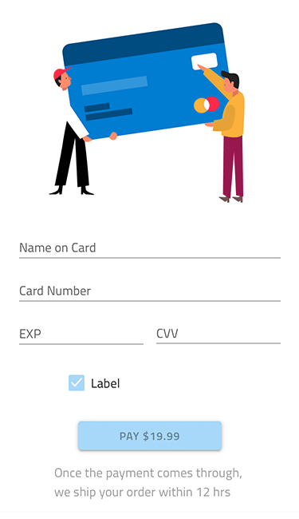
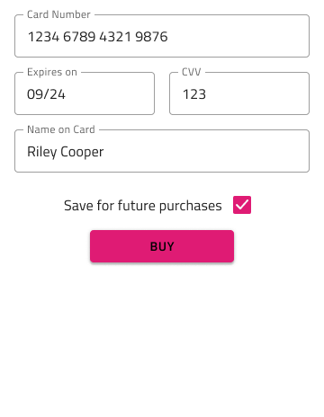

## Feedback と Contact フォーム

製品やサービスを改善するために顧客から特定の情報を入手したい場合の Feedback フォームと、ビジネスに簡単にアクセスできることを示したいが、メール アドレスを直接公開したくない場合の Contact  フォームがあります。

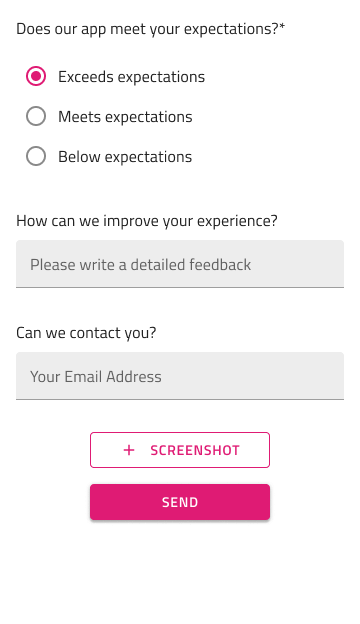
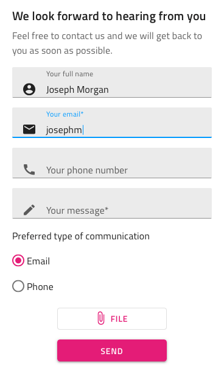

## Subscription と Free Trial フォーム

Subscription フォームは、会社や製品に関心のあるユーザーの電子メール アドレスを合法的に収集することによってリードを生成するのに適しています。訪問者がサービスまたは製品の無料トライアルにサインアップするのを支援したい場合のための Free Trial フォームもあります。

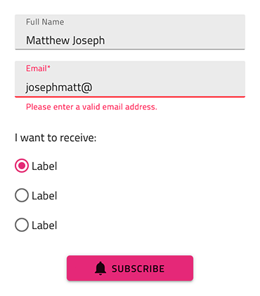
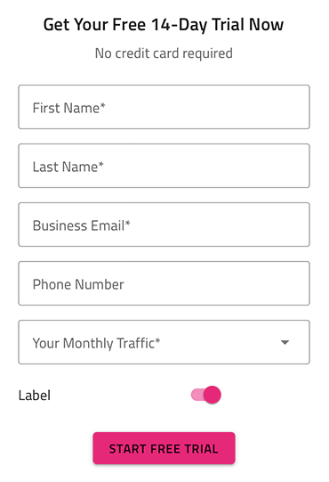

## Email と Appointment フォーム

複数のアドレスにメールを送信するのに適した Email フォームと、医師の診察、ビザの申請、就職の面接、またはその他の正式な会議に最適な Appointment フォームがあります。

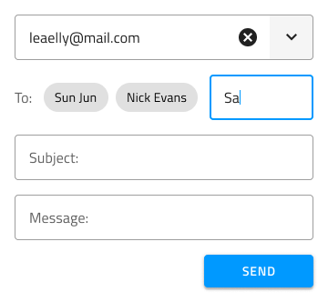

## その他のリソース

関連トピック:

- [Illustrations](../style/illustrations.md)
- [Button](../components/button.md)
- [Checkbox](../components/checkbox.md)
- [Chips](../components/chips.md)
- [Combo](../components/combo.md)
- [Hyperlink](../components/hyperlink.md)
- [Input](../components/input.md)
- [List](../components/list.md)
- [Slider](../components/slider.md)
- [Switch](../components/switch.md)
- [Tabs](../components/tabs.md)
  

コミュニティに参加して新しいアイデアをご提案ください。

