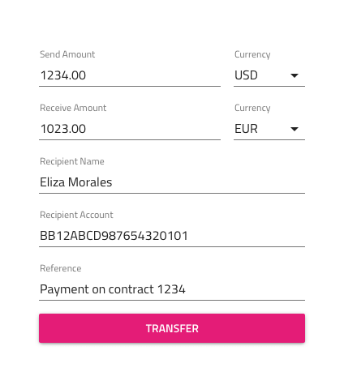
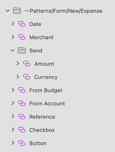

---
title: Form - デザイン システム パターン
_description: Form パターン シンボルは様々なデータ入力および表示要素を含みます。
_keywords: デザイン システム, Sketch, Ignite UI for Angular, パターン, UI ライブラリ, ウィジェット
_language: ja
---

## Form

Form パターンを使用すると、複数のユーザー入力が必要なアプリケーション シナリオを実装できます。全般的なフォームでデータ入力および表示コンポーネントが使用されます。

Form パターンのレイアウトに含まれる Input、Checkbox、Button、Hyperlink、および Text のスタイル設定を使用できます。

### レイアウトおよびタイプ

Form パターンは 2 つのメイン領域に分割されます。Inputs 領域は入力する情報を含むメイン コンテンツ領域です。Actions 領域は「利用規約」または「アカウントを記憶する」チェックボックス、「パスワード忘れ」リンク、またはフォーム送信のボタンなどの操作が配置される領域です。Actions 領域は選択可能な項目の 3 つの行に配置されます。選択可能な項目は Button、Checkbox、Link、Text Area、またはデフォルトでボタンとして表示されるが、以前の項目の組み合わせが可能な Two Actions。

Form パターンはログインと登録、予約、アドレス、支払、およびコンテンツの追加のための新規などの全般的なシナリオのフォームを提供します。

##### ログインと登録フォーム

ログインと登録フォームは 2 つのグループで配置されます。両方が Content および Action 領域がある簡単なレイアウトがあり、またはソーシャル ログインまたは登録のための追加の Action 領域を含む高度なレイアウトがあります。

ログイン フォームにも水平レイアウトがあり、レイアウトの Button および Hyperlink コンテンツを更新した後に登録フォームをカスタマイズできます。このレイアウトは幅が広い画面に最適です。フォームがその他のコンテンツとインラインに表示されます。

##### 予約フォーム

Inputs オーバーライドで選択可能な予約フォームプリセットが 4 つあります。**Dates + People** は全般的なフォームです。Dates + People + Rooms はホテルの予約に使用できます。Airports + Dates + People は飛行機のチケットやその他の乗車券の予約に使用できます。Location + People + Rooms もホテル予約に使用できます。

##### 新規フォーム

Inputs オーバーライドで選択可能な新規フォームの 2 種類があります。**Expense** は新しい経費の作成のための情報フォームです。Budget は新しい予算の作成のための情報フォームです。

##### 支払フォーム

支払フォームの 2 種類があります。クレジット カードの支払フォームおよびオンライン銀行で現金の支払フォームがあります。現金転送フォームは Inputs オーバーライドで選択可能な 4 つのレイアウトを提供します。 **Currency Exchange** は為替換算のフィールドを含みます。Donation は慈善のフォームです。Between Accounts は同じ銀行で複数のアカウントの間の送金に使用できます。Between Banks は他の銀行への送金に使用できます。

> [!WARNING]
> ...

## その他のリソース

関連トピック:

- [Button](button.md)
- [Checkbox](checkbox.md)
- [Hyperlink](hyperlink.md)
- [Input](input.md)
- [Text](text.md)
  

コミュニティに参加して新しいアイデアをご提案ください。

- [Indigo Design **GitHub** (英語)](https://github.com/IgniteUI/design-system-docfx)
