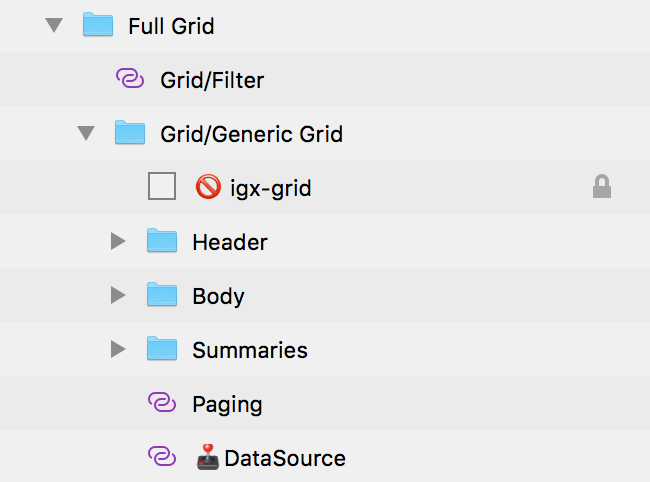

---
title: Full Grid - デザイン システム パターン
_description: Full Grid パターン シンボルは完全なグリッド コンポーネントを表します。 
_keywords: デザイン システム, デザイン システム UX, UI キット, Sketch, Ignite UI for Angular, Sketch to Angular, Angular, Angular デザイン システム, Sketch からコードをエクスポート, Angular 用のデザイン キット, Sketch HTML, Sketch to HTML, Sketch UI キット
_language: ja
---

## Full Grid

テーブルのデザイン時に Full Grid パターン シンボルを代わりの開始点として使用します。すべての機能が構成されたコンポーネント ライブラリで提供される Grid コンポーネントを提供します。

- 並べ替え
- フィルタリング
- 集計
- ページング

> [!WARNING]
> Full Grid パターンを挿入した後、Angular コードとして生成するには、レイアウトを作成したコンポーネントおよび Grid シンボルに分割するために `Detach from Symbol` をトリガーします。ただし、各コンポーネントおよび Grid シンボルをデタッチしないでください。

## その他のリソース

関連トピック:

- [Grid](../components/grid.md)

コミュニティに参加して新しいアイデアをご提案ください。

- [Indigo Design **GitHub** (英語)](https://github.com/IgniteUI/design-system-docfx)
