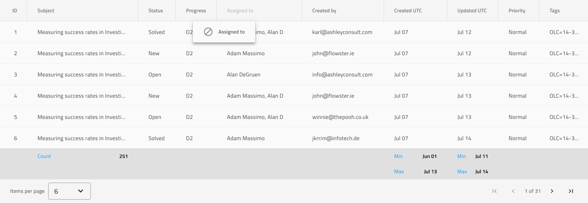

# Grid (グリッド)

表形式データ レイアウトを設計する場合は、Grid パターン シンボルを代わりの開始ポイントとして使用します。すべての機能が構成された Components ライブラリで提供される完全な Grid コンポーネントを提供します。

列移動、集計、ページングを使用した Grid パターンを以下に示します:

すべてのグリッド機能のリスト:
- 並べ替え
- フィルタリング
- 集計
- ページング
- 編集
- 列移動
- 列サイズ変更
- 列非表示
- 表示密度
- Excel スタイル フィルタリング
- 高度なフィルタリング
- グループ化
- ピン固定
- 行選択
- 行編集
- アクティブ セル
- エクスポート
- ツールバー

Grid パターン シンボルには、6 つの作成済み Grid 機能の組み合わせがあります。
- 列の移動、集計、ページングを使用した Grid パターン
- 編集およびフィルター行を使用した Grid パターン
- Excel スタイル フィルター、並べ替え、表示密度を使用した Grid パターン
- グループ化、列サイズ変更、集計を使用した Grid パターン
- ピン固定、行選択、アクティブ セルを使用した Grid パターン
- ツールバー、エクスポート、行編集、列非表示を使用した Grid パターン

> [!WARNING]
> Sketch では、Grid パターンのいずれかを挿入した後、データのすべてのディメンションを表示し、必要な数の表示可能なレコードを挿入するために、提供されたセルの数を変更する必要がある場合にのみ、`Detach from Symbol` をトリガーできます。ただし、各コンポーネントおよび機能をデタッチしないでください。
>
> Adobe XD では、パターン自体のグループ化を解除することなく、列と行を複製することで提供されるよりも多くのセルを追加できます。

## その他のリソース

関連トピック:

- [Grid](../components/grid.md)

コミュニティに参加して新しいアイデアをご提案ください。
