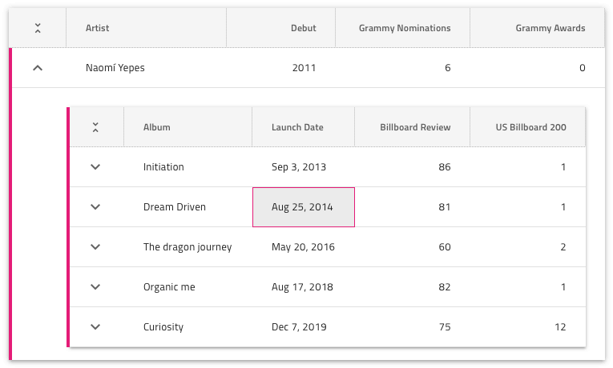
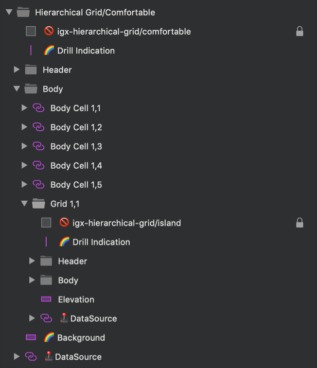

# Hierarchical Grid (階層グリッド)

ネストされた子を持つ複雑な Grid 階層とその機能を設計する場合は、開始ポイントとして Hierarchical Grid パターンを使用します。アクティブ セルと、親グリッドと子グリッド間の関係の視覚的表現を備えた、親グリッドとネストされた子グリッドを提供します。

すべてのグリッド機能のリスト:
- 並べ替え
- フィルタリング
- 集計
- ページング
- 編集
- 列移動
- 列サイズ変更
- 列非表示
- 表示密度
- Excel スタイル フィルタリング
- グループ化
- ピン固定
- 行選択
- 行編集
- アクティブ セル
- エクスポート
- ツールバー

すべてのグリッド機能は、各子および親グリッドに適用できます。

> [!WARNING]
> Hierarchical Grid パターンを挿入した後、Angular コードとして生成できるには、レイアウトを作成したコンポーネントおよび Grid Features に分割するために `Detach from Symbol` をトリガーします。ただし、各コンポーネントおよび Grid Features をデタッチしないでください。

## その他のリソース

関連トピック:

- [Hierarchical-Grid](../components/hierarchical-grid.md)

コミュニティに参加して新しいアイデアをご提案ください。

