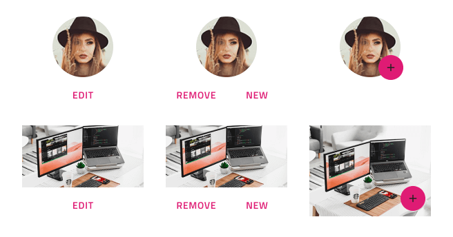

---
title: Image Manipulation - デザイン システム パターン
_description: Image Manipulation パターン シンボルは影響する画像のクリック アクションを提供します。
_keywords: デザイン システム, Sketch, Ignite UI for Angular, パターン, UI ライブラリ, ウィジェット
_language: ja
---

## Image Manipulation

Image Manipulation パターンを使用すると、画像または写真を含む Avatar を編集、更新、変更、またはその他のクイック アクションを実行できます。

Image Manipulation パターンは、レイアウトに含まれる Avatar および複数の Button のスタイル設定をカスタマイズできます。

## レイアウト

Image Manipulation パターンは 1 ～ 2 Flat Button、FAB Button、または Icon Button を含むレイアウトで規格の画像および Avatar をサポートします。

> [!WARNING]
> Image Manipulation パターンを挿入した後、Angular コードとして生成するには、`Detach from Symbol` をトリガーします。ただし、各コンポーネントをデタッチしないでください。

## その他のリソース

関連トピック:

- [Avatar](../components/avatar.md)
- [Button](../components/button.md)
  

コミュニティに参加して新しいアイデアをご提案ください。

