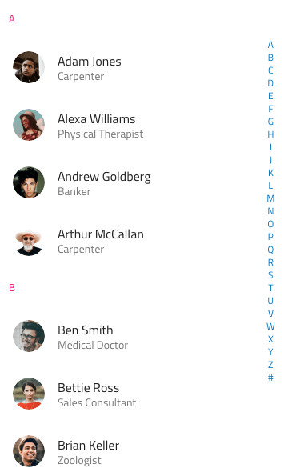
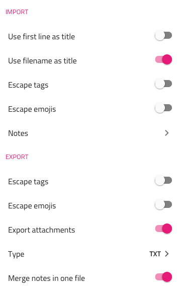
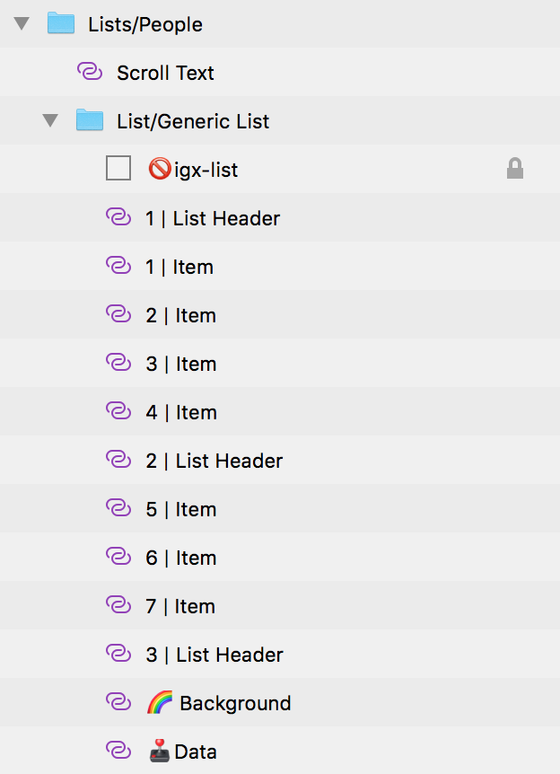

---
title: Lists - デザイン システム パターン
_description: Lists パターン シンボルは情報のコレクションを体系化するためにリストを使用するシナリオを表します。
_keywords: デザイン システム, Sketch, Ignite UI for Angular, パターン, UI ライブラリ, ウィジェット
_language: ja
---

## Lists

Lists パターン シンボルは、フィルター可能な設定、人、ミュージック プレイリスト、検索可能なリスト、設定などの全般的なシナリオを表示するデータ コレクションのプリセットとして使用できます。

Lists パターンは List Item の様々なタイプおよび (ある場合) Searchbar Input のスタイル設定をカスタマイズできます。

> [!WARNING]
> 利用可能な任意の List パターンを挿入後、Angular コードとして生成するには、レイアウトを作成したコンポーネントに分割するために `Detach from Symbol` をトリガーします。各 List Item、背景、およびデータ バインディング レイヤーはデタッチしないでください。

## その他のリソース

関連トピック:

- [Input](../components/input.md)
- [List](../components/list.md)
  

コミュニティに参加して新しいアイデアをご提案ください。

