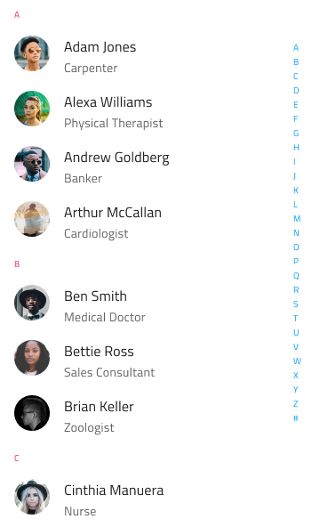
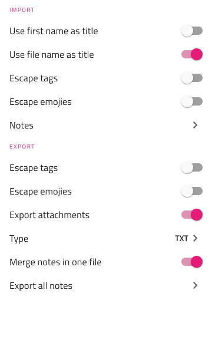

## Lists

Lists パターン シンボルは、人、ソーシャル メディア ストーリー、複数行リスト要素、設定、最近使用した項目、製品、項目のカテゴリなどの一般的なシナリオを表す水平または垂直レイアウトのデータの体系化されたコレクションのプリセットとして使用します。

### Empty State (空の状態)

Empty State List パターン シンボルを使用して、利用可能な結果がない検索を示します。

### Group of Items (項目のグループ化)

Group of Items List パターン シンボルを使用して、グループ化されたまたは体系化された項目を示します。

> [!Note]
> パターン シンボル内にネストされた図はコード生成できず、図自体を手動で挿入する必要があります。

> [!WARNING]
> 利用可能な任意の List パターンを挿入後、Angular コードとして生成するには、レイアウトを作成したコンポーネントに分割するために `Detach from Symbol` をトリガーします。各 List Item、背景、およびデータ バインディング レイヤーはデタッチしないでください。

## その他のリソース

関連トピック:

- [Input](../components/input.md)
- [List](../components/list.md)
- [Avatar](../components/avatar.md)
- [Navbar](../components/navbar.md)
- [Text](../components/text.md)
  

コミュニティに参加して新しいアイデアをご提案ください。

