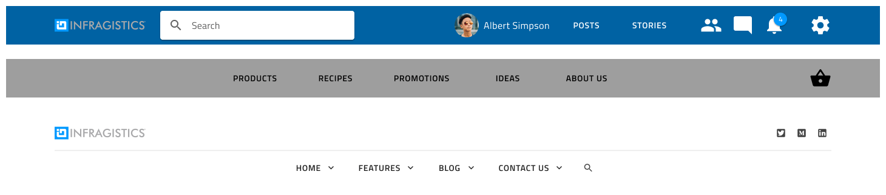
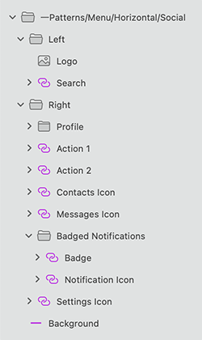

## Menu (メニュー)

Menu シンボルは、ロゴ、メニュー項目、検索入力、さまざまなアクション、アカウント設定などの要素を含むアプリケーションまたは Web ページのナビゲーション バーを開発するためのプリセットとして使用します。

> [!WARNING]
> 利用可能な任意の Menu パターンを挿入した後、Angular コードとして生成できるには、レイアウトを作成したコンポーネントに分割するために `Detach from Symbol` をトリガーします。各メニュー要素、背景およびデータ バインディング レイヤーはデタッチしないでください。

## その他のリソース

関連トピック:

- [Input](../components/input.md)
- [Avatar](../components/avatar.md)
  

コミュニティに参加して新しいアイデアをご提案ください。

