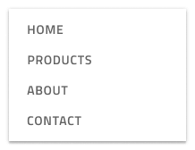

# Menu (メニュー)

Menu シンボルは、ロゴ、メニュー項目、検索、さまざまなアクション、アカウント設定などの要素を含むアプリケーションまたは Web ページのナビゲーション バーを開発するためのプリセットとして使用します。

## 方向

メニュー プリセットは、方向に従って水平と垂直にグループ化されます。

> [!WARNING]
> 利用可能な任意の Menu パターンを挿入した後、Angular コードとして生成できるには、レイアウトを作成したコンポーネントに分割するために `Detach from Symbol` をトリガーします。各メニュー要素および背景はデタッチしないでください。

## その他のリソース

関連トピック:

- [Avatar](../components/avatar.md)
- [Badge](../components/badge.md)
- [Bottom Navigation](../components/bottom-nav.md)
- [Button](../components/button.md)
- [Dropdown](../components/dropdown.md)
- [Icon](../components/icon.md)
- [Input](../components/input.md)
- [Navigation Drawer](../components/nav-drawer.md)
- [Tooltip](../components/tooltip.md)
  

コミュニティに参加して新しいアイデアをご提案ください。

