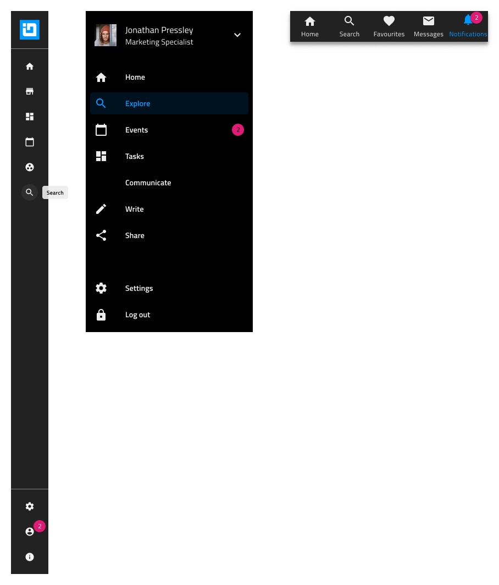

# Menu (メニュー)

Menu シンボル (コンポーネント) は、ロゴ、メニュー項目、検索、さまざまなアクション、アカウント設定などの要素を含むアプリケーションまたは Web ページのナビゲーション バーを開発するためのプリセットとして使用します。

## メニューのタイプ

メニューには、方向に応じて Horizontal (水平) と Vertical (垂直) の 2 つのタイプがあります。

さらに、メニュー パターンには、Navigation Drawer コンポーネントと Bottom Navigation コンポーネントに基づくバリエーションも用意されています。

## その他のリソース

関連トピック:

- [Avatar](../components/avatar.md)
- [Badge](../components/badge.md)
- [Bottom Navigation](../components/bottom-nav.md)
- [Button](../components/button.md)
- [Dropdown](../components/dropdown.md)
- [Icon](../components/icon.md)
- [Input](../components/input.md)
- [Navigation Drawer](../components/nav-drawer.md)
- [Tooltip](../components/tooltip.md)
  

コミュニティに参加して新しいアイデアをご提案ください。

