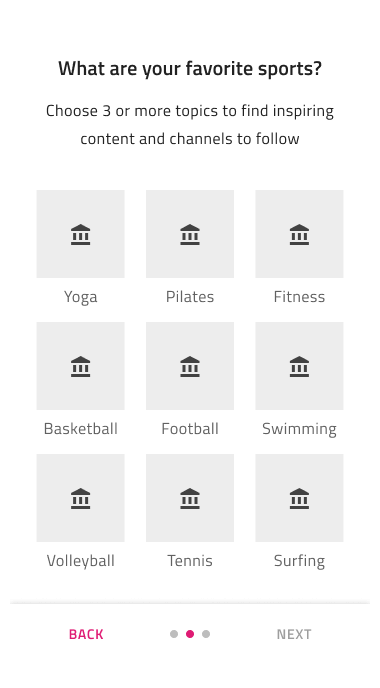
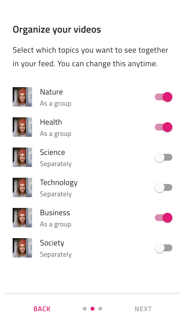

# Onboarding (オンボーディング)

Onboarding シンボルをプリセットとして使用して、いくつかの手順でオンボーディング エクスペリエンスを開発します。通常、オンボーディング エクスペリエンスは、最も重要なアプリケーション機能、アプリケーションを最初に使用する方法の詳細、またはアプリケーション画面の概要を紹介する最大 5 ステップで表示されます。

**Indigo.Design システム**は、最も一般的なアプリケーション シナリオのいくつかをカバーするオンボーディング フローの 7 つのプリセット バージョンを提供します。

## その他のリソース

関連トピック:

- [Input](../components/input.md)
- [Illustrations](../style/illustrations.md)
  

コミュニティに参加して新しいアイデアをご提案ください。

