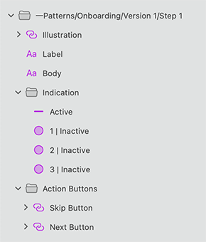

# Onboarding (オンボーディング)

Onboarding シンボルをプリセットとして使用して、いくつかの手順でオンボーディング エクスペリエンスを開発します。通常、オンボーディング エクスペリエンスは、最も重要なアプリケーション機能、アプリケーションを最初に使用する方法の詳細、またはアプリケーション画面の概要を紹介する最大 5 ステップで表示されます。

The **Indigo.Design System** provides you with 7 preset versions of onboarding flows that cover some of the most common application scenarios.

> [!WARNING]
> 利用可能な任意 Onboarding パターンを挿入した後、Angular コードとして生成できるには、レイアウトを作成したコンポーネントに分割するために `Detach from Symbol` をトリガーします。Illustrations used in these patterns cannot be code generated and they have to be added manually afterwards. 各 Onboarding 要素と背景はデタッチしないでください。

## その他のリソース

関連トピック:

- [Input](../components/input.md)
- [Illustrations](../style/illustrations.md)
  

コミュニティに参加して新しいアイデアをご提案ください。

