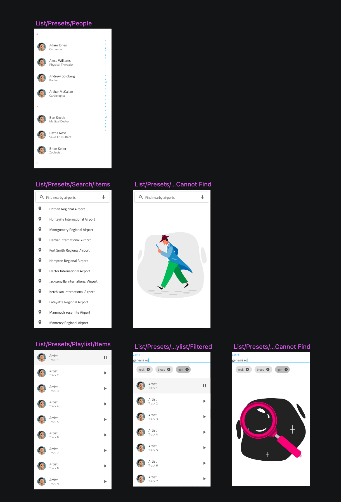

# パターンの概要

**Indigo.Design システム**は、Indigo.Design コンポーネントから作成された 180 以上の UI パターンで生産性を向上します。これらは同じレスポンシブ Web デザイン動作およびテーマ機能で拡張されています。UI パターンは、Sketch ライブラリの個別のページにまたがって表示されます。Adobe XD ライブラリでは、ライブラリ ファイルの右側の列に表示されます。

- 🌆 AV Player (AV プレーヤー)
- 🌆 Avatar + Badge (アバター + バッジ)
- 🌆 Cards (カード)
- 🌆 Chat (チャット)
- 🌆 Data Visualizations (データ ビジュアライゼーション)
- 🌆 Details (ディテール)
- 🌆 Dialogs (ダイアログ)
- 🌆 Empty State (空の状態)
- 🌆 File Upload および Image Manipulation (ファイル アップロードおよび画像操作)
- 🌆 Footer (フッター)
- 🌆 Form (フォーム)
- 🌆 Grids (グリッド)
- 🌆 Lists (リスト)
- 🌆 Menus (メニュー)
- 🌆 Onboarding (オンボーディング)
- 🌆 Pricing Table (プライシング テーブル)
- 🌆 Scheduling (スケジュール)
- 🌆 Social Feed (ソーシャル フィード)
- 🌆 Tiles (タイル)
- 🌆 User Profile (ユーザー プロファイル)

> [!WARNING]
> コンポーネントとは異なり、Sketch ライブラリの一部のパターンは、グループとして表示するために切り離すことができ、その前に定義したルック アンド フィールを保持します。ただし、Adobe XD では、パターンのグループ化を解除すると、ネストされたすべてのコンポーネントがグループに変換され、それらの構造を正しくトレースできなくなるため、結果のレイアウトからコードを生成する機能に壊滅的な影響があります。パターンのグループ化を解除せずに、Adobe XD で状態、レイアウト、およびスタイルの調整を行うことができるため、これらのパターン全体をアートボードに保持することをお勧めします。また、Sketch と Adobe XD の両方で、ライブラリからパターンのリンクを解除すると、デザイン システムの後続のバージョンからの更新を自動的に適用できなくなることにも注意してください。

コンポーネントとは異なり、すべてのパターンはグループとして表示するためにデタッチでき、その前に定義したルックアンドフィールを保持します。以下は、連絡先リスト、検索可能およびフィルター可能なリスト、一致する結果が見つからない場合の空の状態のリストなどの [List パターン](lists.md)のスニペットです。

パターンが常に改善され、新しいパターンも追加されています。**Indigo.Design システム**のリリース間の変更をより簡単に識別するために、更新を含む Sketch ページおよび Adobe XD アートボードに 🆕 絵文字を追加します。デザインで繰り返し使用するインターフェイス レイアウトから独自のパターンを作成してデフォルト セットを拡張し、デザインの生産性をさらに向上できます。

## その他のリソース

関連トピック:

- [スタイル設定](../style/styling-overview.md)
- [コンポーネント](../components/components-overview.md)
  

コミュニティに参加して新しいアイデアをご提案ください。
