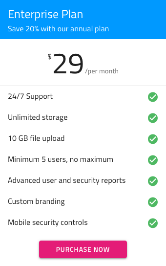
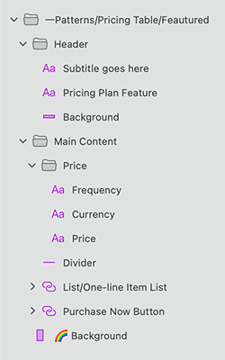

## Pricing Table (プライシング テーブル)

Pricing Plan シンボルをプリセットとして使用して、製品またはサブスクリプション プランのさまざまな料金プランを表示します。各料金プランには、プラン名、料金、含まれているか含まれていない機能のリスト、および call-to-action ボタンが含まれています。Pricing Plan シンボルには、2 つのタイプ (お買い得 あり/なし) があります。

> [!WARNING]
> 利用可能な任意の Pricing Table をパターンとして挿入後、Angular コードとして生成できるには、レイアウトを作成したコンポーネントに分割するために `Detach from Symbol` をトリガーします。各 Pricing Table の要素、背景およびデータ バインディング レイヤーはデタッチしないでください。

## その他のリソース

関連トピック:

- [Avatar](../components/avatar.md)
- [Text](../components/text.md)
  

コミュニティに参加して新しいアイデアをご提案ください。

