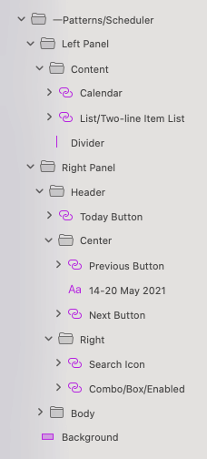

## Scheduler (スケジューラ)

Scheduler シンボルをプリセットとして使用して、プロジェクト管理、タスク管理、会議プランナー、または電子メール アプリケーションの一部として Scheduler を表示します。注: Scheduler シンボルはスケジューラを示すインターフェイスです。スケジューリング機能はありません。

> [!WARNING]
> 利用可能な Scheduler をパターンとして挿入後、Angular コードとして生成できるには、レイアウトを作成したコンポーネントに分割するために `Detach from Symbol` をトリガーします。各 Scheduler 要素、背景およびデータ バインディング レイヤーはデタッチしないでください。

## その他のリソース

関連トピック:

- [Calendar](../components/calendar.md)
- [List](../components/list.md)
- [Input](../components/input.md)
- [Button](../components/button.md)
  

コミュニティに参加して新しいアイデアをご提案ください。

