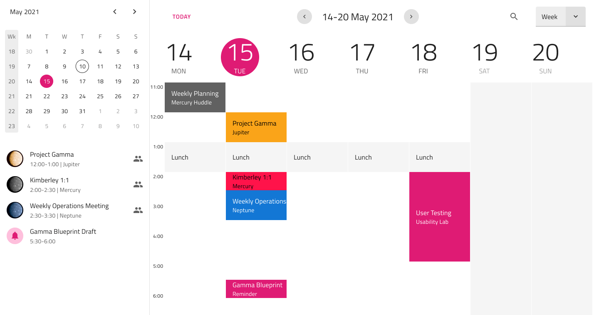

# Scheduler (スケジューラ)

Scheduler パターンをプリセットとして使用して、プロジェクト管理、タスク管理、会議プランナー、または電子メール アプリケーションの一部としてスケジューラを表示します。注: Scheduler パターンはスケジューラを示すインターフェイスです。スケジューリング機能はありません。

## その他のリソース

関連トピック:

- [Calendar](../components/calendar.md)
- [List](../components/list.md)
- [Button](../components/button.md)
- [Combo](../components/combo.md)
- [Icon](../components/icon.md)
  

コミュニティに参加して新しいアイデアをご提案ください。

