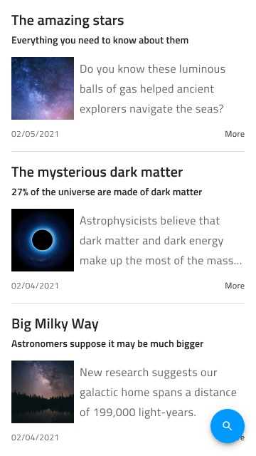

# Social Feed (ソーシャル フィード)

Social Feed パターンを使用して、ニュース記事、ブログ投稿、ソーシャル メディア投稿、テキスト、画像、ビデオなどを使用したコメント セクションなどのさまざまなソーシャル コンテンツ タイプを表示します。モバイルおよびデスクトップ デバイスの画面サイズに適した Social Feed パターンが提供されます。

## その他のリソース

関連トピック:

- [Avatar](../components/avatar.md)
- [Button](../components/button.md)
- [Icon](../components/icon.md)
- [Input](../components/input.md)
- [Navbar](../components/navbar.md)
- [Tabs](../components/tabs.md)
  

コミュニティに参加して新しいアイデアをご提案ください。
