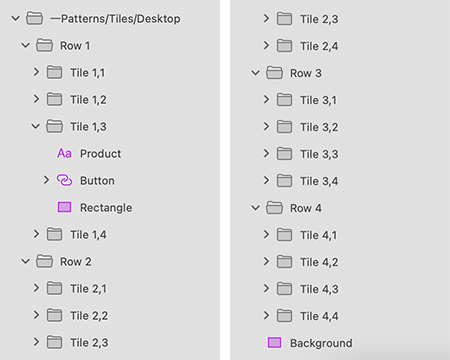

# Tiles (タイル)

Tiles シンボルをプリセットとして使用して、画像や製品名、アプリケーション機能、最近使用した項目、項目のリストなどのアセットの一部を含む製品の概要を表示し、またはリッチ データ ダッシュボードとして表示します。

> [!WARNING]
> 利用可能な Tiles をパターンとして挿入後、Angular コードとして生成するには、レイアウトを作成したコンポーネントに分割するために `Detach from Symbol` をトリガーします。各 Tiles 要素、背景およびデータ バインディング レイヤーはデタッチしないでください。

## その他のリソース

関連トピック:

- [Text](../components/text.md)
- [Button](../components/button.md)
  

コミュニティに参加して新しいアイデアをご提案ください。

