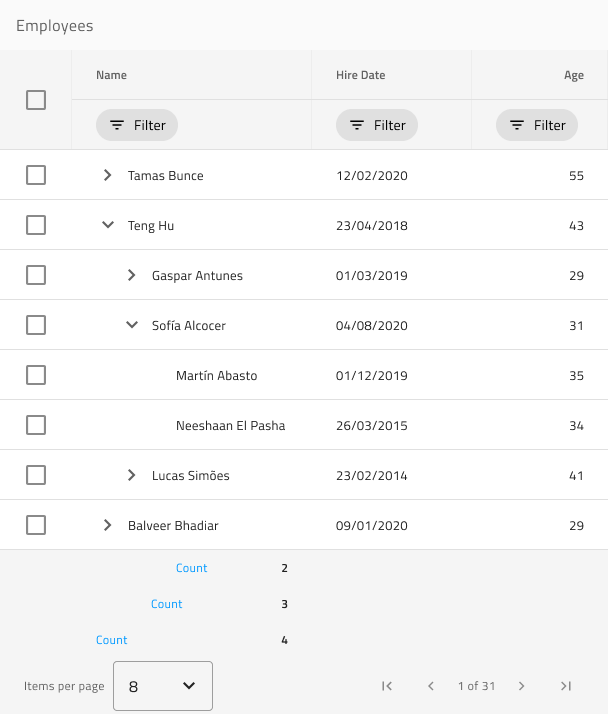

# Tree Grid (ツリー グリッド)

グリッド内の子レコードと親レコードを使用して表形式データ レイアウトを設計する場合は、代替の開始ポイントとして Tree Grid パターン シンボルを使用します。すべての機能が構成されたコンポーネント ライブラリで提供される完全な Tree Grid コンポーネントを提供します。

すべてのグリッド機能のリスト:
- 並べ替え
- フィルタリング
- 集計
- ページング
- 編集
- 列移動
- 列サイズ変更
- 列非表示
- 表示密度
- Excel スタイル フィルタリング
- グループ化
- ピン固定
- 行選択
- 行編集
- アクティブ セル
- エクスポート
- ツールバー

すべてのグリッド機能は、Tree Grid パターンに適用できます。

> [!WARNING]
> Tree Grid パターンを挿入した後、Angular コードとして生成できるには、レイアウトを作成したコンポーネントおよび Grid シンボルに分割するために `Detach from Symbol` をトリガーします。ただし、各コンポーネントおよび Grid シンボルをデタッチしないでください。

## その他のリソース

関連トピック:

- [Tree Grid](../components/tree-grid.md)

コミュニティに参加して新しいアイデアをご提案ください。

