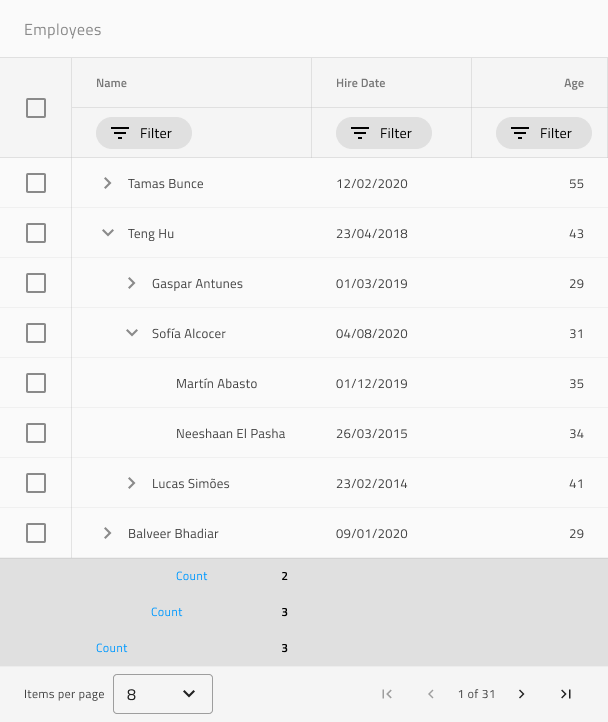

# Tree Grid (ツリー グリッド)

レコード間の親子関係を持つ表形式のデータ レイアウトを設計する場合は、代替の開始ポイントとして Tree Grid パターンを使用します。すべての機能が構成された Components ライブラリで提供される完全な Tree Grid コンポーネントを提供します。

すべてのグリッド機能のリスト:
- 並べ替え
- フィルタリング
- 集計
- ページング
- 編集
- 列移動
- 列サイズ変更
- 列非表示
- 表示密度
- Excel スタイル フィルタリング
- 高度なフィルタリング
- グループ化
- ピン固定
- 行選択
- 行編集
- アクティブ セル
- エクスポート
- ツールバー

すべてのグリッド機能は、Tree Grid パターンに適用できます。

> [!WARNING]
> In Sketch, after inserting the Tree Grid Pattern, you can trigger `Detach from Symbol` only if you need to alter the number of cells provided, in order to show all the dimensions of your data and insert as many visible records as you want. The individual Components and Features, however, must stay intact and not be detached!
>
> In Adobe XD you can add more cells than provided by duplicating columns and rows without ever having to ungroup the pattern itself.

## その他のリソース

関連トピック:

- [Tree Grid](../components/tree-grid.md)

コミュニティに参加して新しいアイデアをご提案ください。
