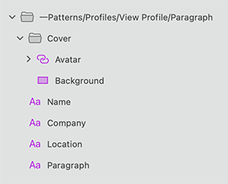

---
title: User Profile - デザイン システム パターン
_description: User Profile パターン シンボルは名前、属性、連絡先の情報などのユーザーに関連する情報を表示するコンポーネントを組み合わせます。
_keywords: デザイン システム, Sketch, Ignite UI for Angular, パターン, UI ライブラリ, ウィジェット
_language: ja
---

## User Profile

User Profile パターンを使用すると、全画面表示の詳細ページまたはヘッダーまたはツールバーに挿入する小さいインジケーターでユーザーに関連する情報を表示します。

User Profile パターンの編集可能なバリアントもあります。User Profile パターンは、レイアウトに含まれる Avatar、Text、および Input のスタイル設定をカスタマイズできます。

> [!WARNING]
> ...

## その他のリソース

関連トピック:

- [Avatar](avatar.md)
- [Text](text.md)
- [Input](input.md)
  

コミュニティに参加して新しいアイデアをご提案ください。

- [Indigo Design **GitHub** (英語)](https://github.com/IgniteUI/design-system-docfx)
