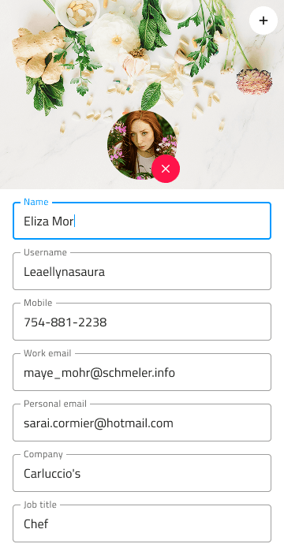

---
title: User Profile - デザイン システム パターン
_description: User Profile パターン コンポーネントは名前、属性、連絡先の情報などのユーザーに関連する情報を表示するコンポーネントを組み合わせます。
_keywords: デザイン システム, デザイン システム UX, UI キット, Ignite UI for Angular, Angular, Angular デザイン システム, Angular 用のデザイン キット, Figma, Figma to Angular, Figma からコードをエクスポート, Figma HTML, Figma to HTML, Figma UI キット
_language: ja
---

# User Profile (ユーザー プロファイル)

User Profile パターンを使用すると、全画面表示の詳細ページまたはヘッダーまたはツールバーに挿入する小さいインジケーターでユーザーに関連する情報を表示します。

User Profile パターンの編集可能なバリアントもあります。User Profile パターンは、レイアウトに含まれる Avatar および Input のスタイル設定をカスタマイズできます。

## その他のリソース

関連トピック:

- [Avatar](../components/avatar.md)
- [Button](../components/button.md)
- [Input](../components/input.md)
- [File Upload パターン](file-upload.md)
  

コミュニティに参加して新しいアイデアをご提案ください。

