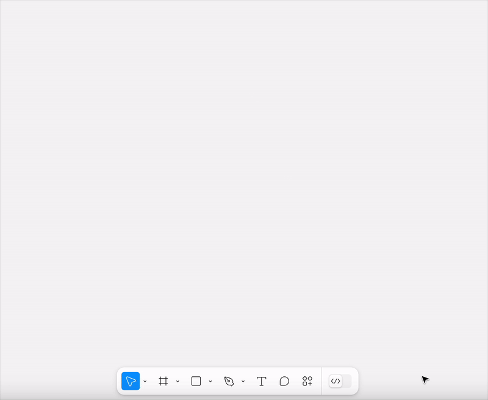
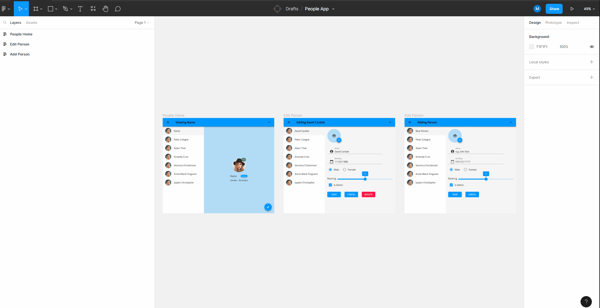
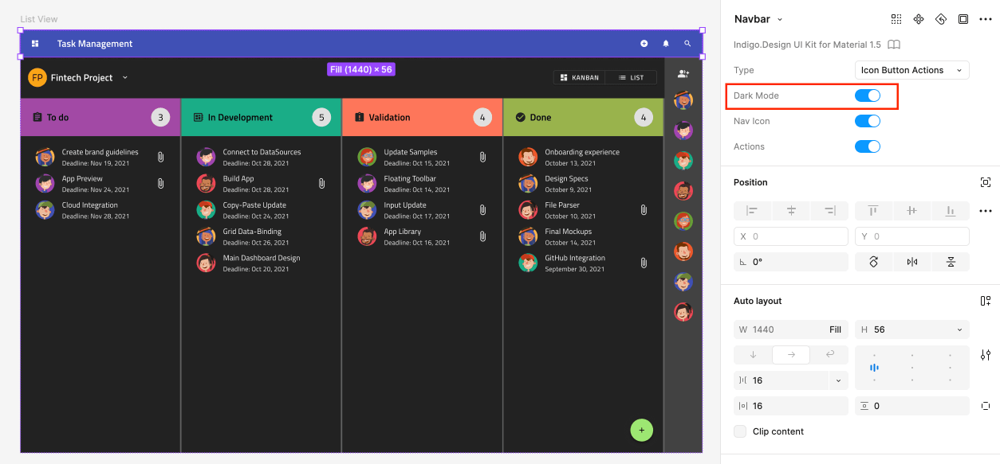

# Indigo.Design Figma プラグイン

Indigo.Design Figma プラグインを使用して、自分のデザインから Indigo.Cloud App Builder でアプリをすばやく作成して公開できます。

[こちら](https://www.figma.com/@infragistics)からダウンロードできる Indigo.Design UI キット ライブラリ コンポーネントを使用してデザインを作成したら、プラグインを使用してデザインをエクスポートできます。

Indigo.Design AppBuilder でアプリをすばやく作成できます。このアプリは、Figma デザインの構造に従い、Indigo.Design UI キットのシンボルを Ignite UI の対応するコンポーネントにマッピングします。またこのプラグインは、Figma で使用されている画像を取得し、[`Assets` サポート (英語)](https://www.infragistics.com/community/blogs/b/jason_beres/posts/indigo-design-app-builder-october-release-with-assets-support) を使用して App Builder の下の Assets ライブラリにアップロードします。  

## 1.Indigo.Design Figma プラグインのインストール

Indigo.Design Figma プラグインは、Figma のコミュニティ プラグインのリストから入手できます。 

 [こちら](https://www.figma.com/community/plugin/1170035114372031474)からもご覧いただけます。

## 2.App Builder でアプリケーションを作成します

デザインの準備ができたら、プラグインを使用してアプリを作成できます。

## 3テーマ

### グローバル テーマの設定

Indigo.Design System for Figma のグローバル テーマは、ダークまたはライトのいずれかです。Indigo.Design Figma プラグインは、Indigo.Design ライブラリ コンポーネントの `Dark Mode` バリエーションに基づいてデフォルトのテーマを設定します。

これは、Figma ファイル内のコンポーネントの数をライトのバリエーションで計算するヒューリスティックの助けを借りて適用されます。より多くのコンポーネントで `Dark Mode` が有効になっている場合は、ダーク テーマが設定されます。

### カラー ハンドリング

Indigo.Design UI Kit for Figma には、`primary`、`secondary`、`grays`、および 2 つのチャート `series` のカラーのそれぞれに 10 のカラー バリエーションを備えた 5 つのパレットと、`success`、`warn`、`info`、`surface` などの特別なカラーが含まれています。これらのカラーはすべて、塗りまたは線のカラーとして適用できます。 
下の表にカラーが記載されている場合、App Builder はそのカラーをその名前 (例: `primary-900`) と共に表示します。他のすべてのカラーは、HEX/RGB 値として表示されます。

| Primary | Secondary |  Gray   | Surface | Error | Success | Warn  | Info  |
| :-----: | :-------: | :-----: | :-----: | :---: | :-----: | :---: | :---: |
| 100-900 |  100-900  | 100-900 |   500   |  500  |   500   |  500  |  500  |

## アセット

デザインで使用される画像やイラストは、アセットとして App Builder に送信され、生成されたアプリケーションの関連する [アセット] タブに表示されます。

シンプルなフラット画像と、より複雑なベクトル ベースのイラストの 2 種類の画像があります。

### 画像

Figma の単純なフラット画像は、通常、画像塗りつぶしを含む四角形として追加されます。

これは、関連する画像アセットを参照する `` 要素として解釈されるか、デザイン内の他の要素の背景として使用された場合は、`background-image` を含むグループ(`div`) として解釈されます。

### イラスト

デザイナーは、多くの場合、カスタム ベクターと図形を使用して、画像アセットとして提供する目的でイラストの画像を作成します。

これらは、多くのグループとベクターで構成される複雑な構造を持つことができます。

デザイナーは、Figma の [エクスポート] タブを使用して、イラストのエクスポートされた画像の種類を指定できます。

PNG、JPG、または SVG から選択できます。

エクスポート オプションが指定されていないが、ページ上でベクトルが検出された場合、プラグインはイラストが開始される最も可能性の高いレイヤーを決定しようとします。画像のような要素 (ベクター、図形など) のみを含む最も近い親を見つけようとし、画像要素ではないもの (テキスト、コンポーネント インスタンスなど) が見つかった場合は停止します。イラストの境界が決定されると、そのコンテンツは SVG 形式でエクスポートされます。

これはベクトルをグループ化する最適な方法ではない可能性があるため、Figma のエクスポート オプションを使用してエクスポートする複雑なイラストをマークすることが常に最善であることに注意してください。

## その他のリソース

関連トピック:

- [Colors](../style/colors.md)
- [Typography](../style/typography.md)

コミュニティに参加して新しいアイデアをご提案ください。