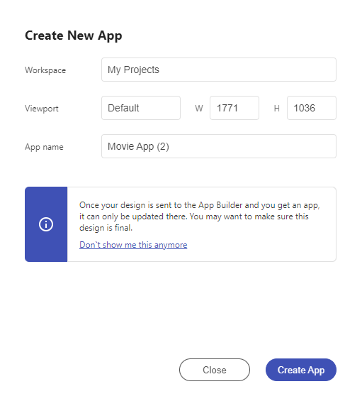

# 概要

Figma、Sketch、XD 用の Indigo.Design プラグインを使用して、Indigo Design App Builder 内でデザインを完全なアプリにすばやく変換できます。

デザインを取り入れて、実際の UI コンポーネントとスタイル設定を備えたインタラクティブでレスポンシブなアプリを作成します。プラグインの `[新しいアプリの作成]` 機能を使用して、App Builder で Figma、Sketch および Adobe XD デザインを 実際のアプリケーションに変換し、画像やテーマに直接アクセスできるようにします。これらはすべてクラウドで直接行われます。

> 注: プラグインを使用するには、ユーザーが [Infragistics アカウント](https://jp.infragistics.com/)でログインするか、新しいアカウントを作成して、Indigo.Design トライアルまたは[サブスクリプション プラン](https://jp.infragistics.com/products/indigo-design/pricing)を取得する必要があります。

プラグインを使用すると、アプリの名前と解像度を選択したり、アプリが作成される Indigo.Design クラウド ワークスペースを選択したりできます。

参照できる各設計ツール用のプラグインがあります。
- [Figma](../plugins/figma-plugin.md)
- [Sketch](../plugins/sketch-plugin.md)
- [Adobe XD](../plugins/xd-plugin.md)

## その他のリソース

関連トピック:

- [Colors](../style/colors.md)
- [Typography](../style/typography.md)

コミュニティに参加して新しいアイデアをご提案ください。