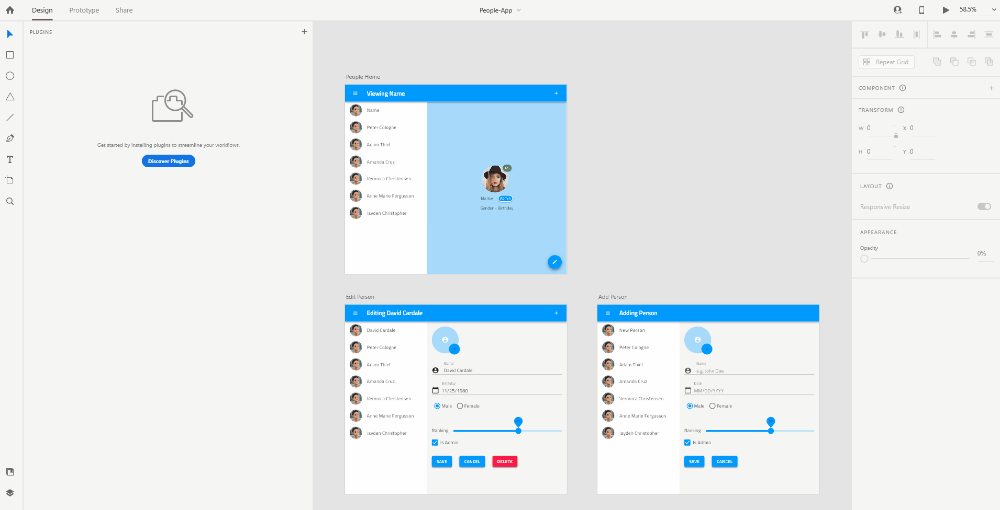
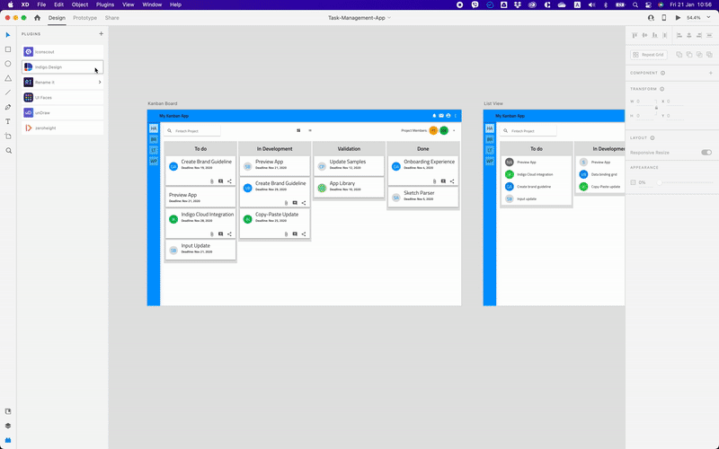

# Indigo.Design XD プラグイン

Indigo.Design XD プラグインを使用して、自分のデザインから Indigo.Cloud App Builder でアプリをすばやく作成して公開できます。

[こちら](https://assets.adobe.com/public/c1a672c5-49e6-4df1-4d32-1c37fa234f1e)からパブリック ライブラリとして追加できる Indigo.Design UI キット ライブラリ コンポーネントを使用してデザインを作成したら、XD プラグインを使用してデザインをエクスポートできます。

Indigo.Design AppBuilder でアプリをすばやく作成できます。このアプリは、XD デザインの構造に従い、Indigo.Design UI キットのシンボルを Ignite UI の対応するコンポーネントにマッピングします。またこのプラグインは、Figma で使用されている画像を取得し、[`Assets` サポート (英語)](https://www.infragistics.com/community/blogs/b/jason_beres/posts/indigo-design-app-builder-october-release-with-assets-support) を使用して App Builder の下の Assets ライブラリにアップロードします。  

## 1.Indigo.Design プラグインのインストール

Indigo.Design プラグインは、Adobe のマーケット プレイスから入手できます。XD のプラグイン メニューから追加できます。

または、[こちら](https://exchange.adobe.com/apps/cc/92c7dec5)で直接アクセスすることもできます。

## 2.App Builder でアプリケーションを作成します

デザインの準備ができたら、プラグインを使用してアプリを作成できます。

## その他のリソース

関連トピック:

- [Colors](../style/colors.md)
- [Typography](../style/typography.md)

コミュニティに参加して新しいアイデアをご提案ください。
