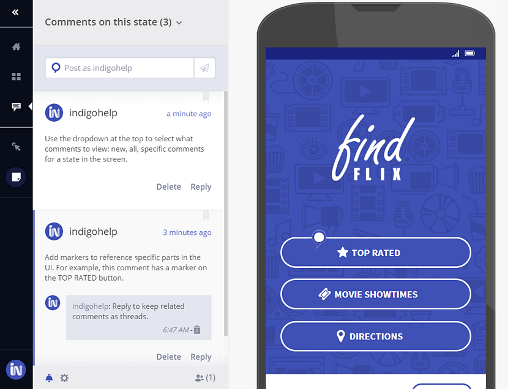

## コメントでアイデアを交換

公開したプロトタイプは、リアルタイムのコメントをサポートします。

プロトタイプ リンクを共有するとプロトタイプ ビューアーのコメント パネルを使用でき、プロトタイプに新しいにコメントが追加されたときにメール通知を受け取るよう設定することも可能です。

プロトタイプのコメントを有効にするには、プロトタイプ ビューアー ツールバーのコメント パネルの設定セクション、またはプロトタイプの詳細パネルにあるコメント オプションを使用します。

コメントにマーカーを追加し、UI とコメントをつなげることができます。マーカーをクリックし、デザイン上でマーカーを置く場所をクリックします。次にコメントを追加します。

> [!Note]
> コメント機能はコミュニティ プロトタイプではサポートされません。

### コメント オプション

目的 | アクション
------------- | -------------
レビューアーの新しいコメントの追加を許可 | 共有アイテムのコメントを許可に設定
レビューアーの新しいコメントの追加を停止 | 共有アイテムのコメントを停止に設定
レビューアーのコメントを非表示 | コメントをアーカイブ
メール通知の受信または受信停止に設定 | 通知をオンまたはオフに設定

## 関連トピック

- [グループ ワークスペースを使用したコラボレーション](workspaces.md)