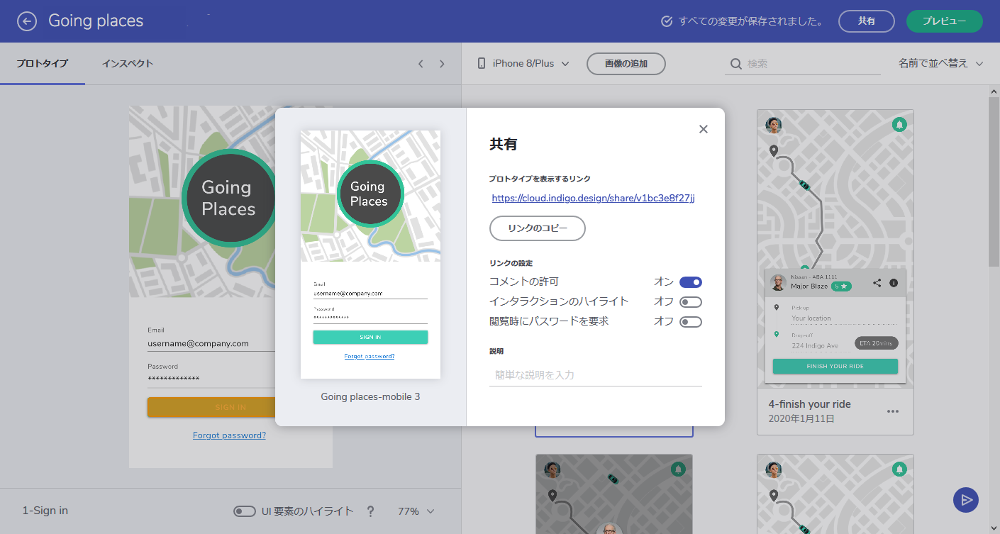

---
title: 最初のプロトタイプを作成
_description: 公開した Indigo.Design プロトタイプに対するリアルタイムのコメント機能。
_keywords: UX デザイン, プロトタイプ, コメント
_language: ja
---

## はじめてのプロトタイプ作成

プロトタイプを作成してエンドユーザーや利害関係者に共有し、フローを検証します。

## 詳細手順

### 1. 新しいプロトタイプの作成

プロトタイプ ギャラリーから \[+\] アイコンの項目を選択し、新しいプロトタイプを作成します。 

### 2. 画像の追加

デザイナーに画像をドロップ、または \[画像の追加\] ボタンをクリックしてローカルにあるファイルを選択します。
追加した画像はプロトタイプのスクリーンになります。

Sketch ドキュメントをドロップして、アートボードを画面に変換することもできます。[Sketch プラグイン](https://cloud.indigo.design/resources)を使用して、Sketch ドキュメントを直接公開してあるいは cloud.indigo.design と同期することをお勧めします。 

### 3. インタラクションの追加

1.  スクリーンを選択して左のパネルに読み込みます。
2.  スクリーン領域上にクリックしてドラッグすると、ホットスポットを作成します。
    

    
    

    
3.  \[インタラクションの追加\] ボタンをクリックします。
      

      
      

    コネクターが表示されます。
4.  右側のパネルでスクリーンの 1 つを選択してクリックします。
    

    
    

    デフォルトで手順 4 で選択したスクリーンへ移動する FADE アニメーションで TAP インタラクションが作成されます。
    

    
    

インタラクションをクリックしてインタラクション パネルを表示します。ナビゲーションをトリガーするユーザー操作、トランジションのアニメーション、トランジションの期間を変更するために使用します。

インタラクション オプションの詳細については、[このトピック](interaction-options.md)を参照してください。

必要なインタラクションをすべて追加してプロトタイプを完了させます。

### 4. プロトタイプのプレビュー

1.  `[プレビュー]` ボタンをクリックします。
    

    
    

    プレビュー モードを開きます。
2.  プロトタイプをインタラクティブに操作します。
3.  `[閉じる]` ボタンをクリックします。
    

    
    

    デザイナーに戻ります。

### 5. プロトタイプの公開

1.  `[公開]` ボタンをクリックします。
    

    
    

2.  プロトタイプを共有して表示するためのリンクを取得します。
    

    

 
レビューアーがプロトタイプにコメントしたり、ユーザーがユーザビリティ テストでフローを確認したりできます。
