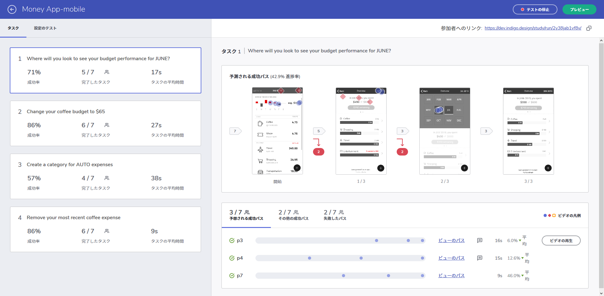
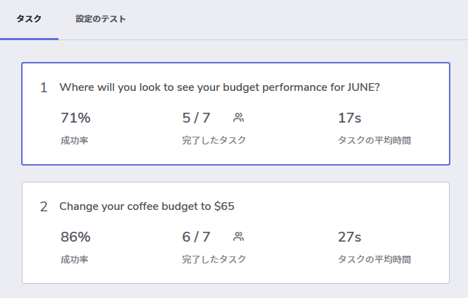
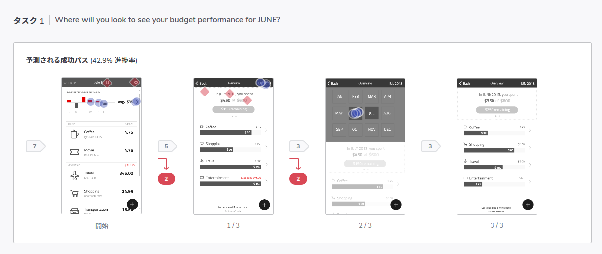
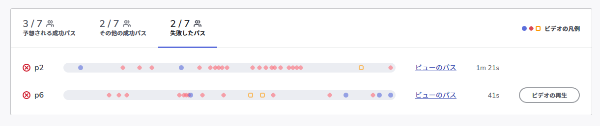
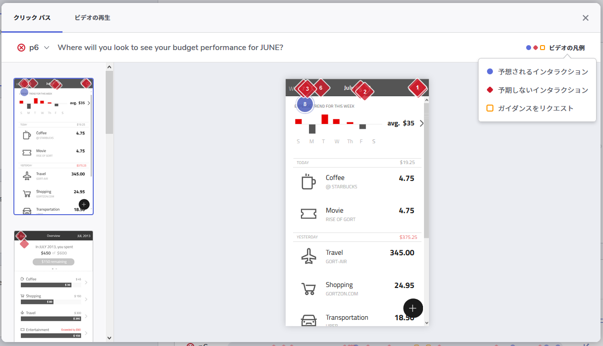
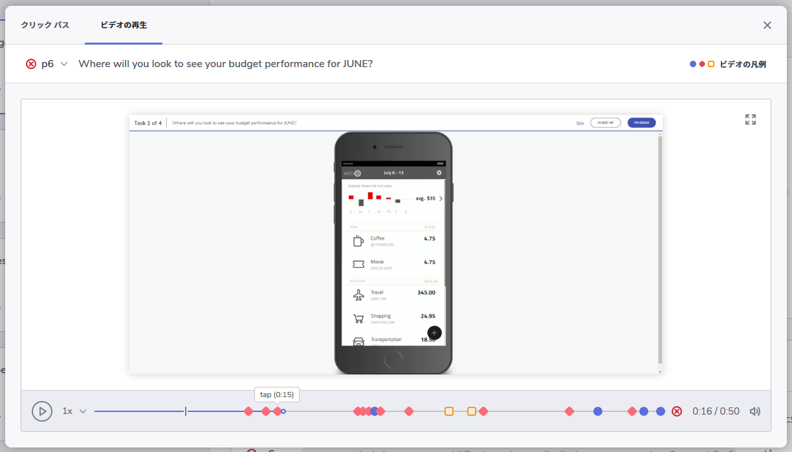

---
title: ユーザー テスト結果をレビュー
_description: テスト概要のレポート、タスクレポート、およびセッション記録ビューア―によってユーサビリティテスト結果をレビューします。
_keywords: UX デザイン, プロトタイプ, コメント, ユーザビリティ テスト, ユーザー テスト
_language: ja
---

## ユーザー テスト結果をレビュー

[ユーザー テストを設定した][topic-1]後、ユーザビリティ テストのダッシュボードに結果の概要が表示されます。

ダッシュボードには以下が含まれます。

*  [テスト分析の概要](#テスト分析の概要)
*  [タスク完了ファンネル＆ファーストクリック レポート](#タスク完了ファンネル＆ファーストクリック-レポート)
*  [ユーザー セグメントと参加の詳細](#ユーザー-セグメントと参加の詳細)
	*  [クリック パス](#クリック-パス)
	*  [ユーザー セッションのビデオの再生](#ユーザー-セッションのビデオの再生)

## テスト分析の概要

テストのすべてのタスクの高レベル分析を表示し、参加者全体のメトリックを集計します。

各タスクごとに確認できる項目:

* 成功率 (タスクを完了した参加者の数をそのタスクの参加者の合計数で割ることによって計算されるパーセンテージ)
* 完了した人数
* タスクの完了にかかった平均時間

タスク カードをクリックすると、各タスクの参加の詳細を確認できます。

> [!Note]
> 平均時間のメトリック計算は、参加者がタスクを完了しなかったセッションを自動的に除外します。

##  タスク完了ファンネル＆ファーストクリック レポート

タスク完了ファンネルは、参加者が予測される成功パスをどのように使用したかを集計します。パスの各手順の画像、および予測された順序でタスクを完了した参加者の数を確認できます。 

完了ファンネルは、以下の分析に役立ちます。 

* **予測される成功パスと完了率** - ユーザビリティ タスクの作成時に設定されたパスと、そのパス (手順の順序) を使用してタスクを完了した参加者の数を示します。
* **ドロップオフ** - 予測されるパスから離れた参加者の数を示します (参加者は 1 回のみ計算されます)。
* **ファーストクリック レポート** - インタラクション マーカーは、参加者の最初のインタラクションが想定通りのインタラクションと一致したかどうかを示します。青色の円形マーカーで表示されます。そうでない場合、想定外のインタラクションまたはクリックミスが発生し、赤色のひし形が表示されます。 

## ユーザー セグメントと参加の詳細

参加者はほとんどのタスクにおいて予期されるパスのみでなく、好きな手順でタスクを完了できます。ユーザー セグメント レポートは、参加者をタスクの完了方法に基づいてグループ (セグメント) に分割します。

ユーザー セグメントは、以下の条件を使用して自動的に作成されます。

* **想定通りのパスで成功した セグメント** - タスクの定義時に作成された手順の順序を使用して、タスクを正常に完了した参加者をグループ化します。
* **代替パスで成功した セグメント** - 予測されるパスとは異なるパスを使用したが、タスクを完了した (最後のステップに到達したなど) 参加者をグループ化します。
* **失敗したパス セグメント** - タスクを完了できない参加者またはタスクをスキップした参加者をグループ化します。

参加の詳細表は、各参加者のセッション分析を示し、以下を示します。

* 参加者がタスクを完了したかどうか
* 参加者のクリックパス。想定通りまたは想定外のインタラクション マーカーの順序として表示されます。
* タスク時間のメトリック
* 参加者がそのタスクのフィードバックを追加した場合の \[フィードバックを表示\] ボタン
* ユーザー ビデオが利用可能な場合の \[ビデオ再生\] オプション

###  クリック パス

マウスを使用してクリックパスにホバーすると、画面のミニプレビューとユーザーがクリックした場所を確認できます。

詳細表のタイムライン マーカーをクリックすると、クリックパス エクスプローラーが起動します。これにより、参加者が実行したすべての手順を確認できます。 

複数のインタラクションがある場合、インタラクション マーカーの番号は、参加者が画面上でインタラクションを行った順序を示します。選択したタスクに関連するインタラクションのみが表示されます。

 

### ユーザー セッションのビデオの再生

詳細表の [ビデオ再生] オプションをクリックすると、セッション ビデオを表示できます。また、\[ビデオ\] タブを選択して、クリックパスを探索しながらビデオを表示できます。

ビデオ タイムラインは、詳細表と同じユーザー インタラクションのタイムラインを表示します。タイムライン マーカーをクリックすると、ビデオの一部に直接ジャンプできます。 

ビデオをダウンロードするには、ビデオを右クリックし、ブラウザーのコンテキスト メニューの \[ビデオの名前を付けて保存\] オプションを使用します。

## 詳細について

ユーサビリティ テストについてのビデオ:

* [ユーザー テストの作成 (英語)](https://www.youtube.com/watch?v=_jCDjtxTLCo&list=PLZ4rRHIJepBs9bwRs1LZLV0ZVzlFKqwCw&index=2)
* [ユーザー テストに参加する (英語)](https://www.youtube.com/watch?v=UK0vZTKCt8I&list=PLZ4rRHIJepBs9bwRs1LZLV0ZVzlFKqwCw&index=3)
* [ユーザー テスト結果をレビュー (英語)](https://www.youtube.com/watch?v=hdVHP01_c1I&list=PLZ4rRHIJepBs9bwRs1LZLV0ZVzlFKqwCw&index=4)

[a-1]: #test-analytics-overview
[a-2]: #task-completion-funnel--1st-click-report
[a-3]: #user-segments--participation-details
[a-4]: #explore-click-path
[a-5]: #video-replay-of-user-sessions

[topic-1]: set-up-a-user-test.md