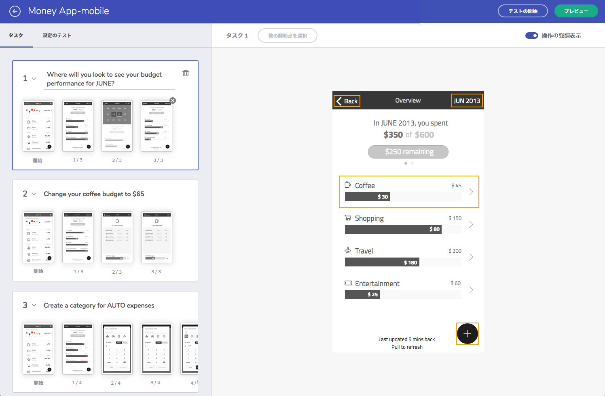
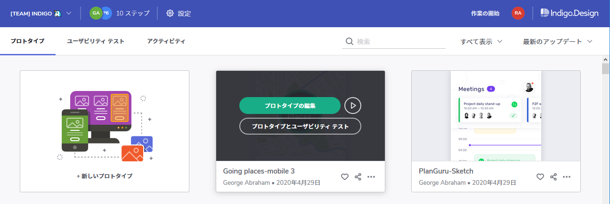
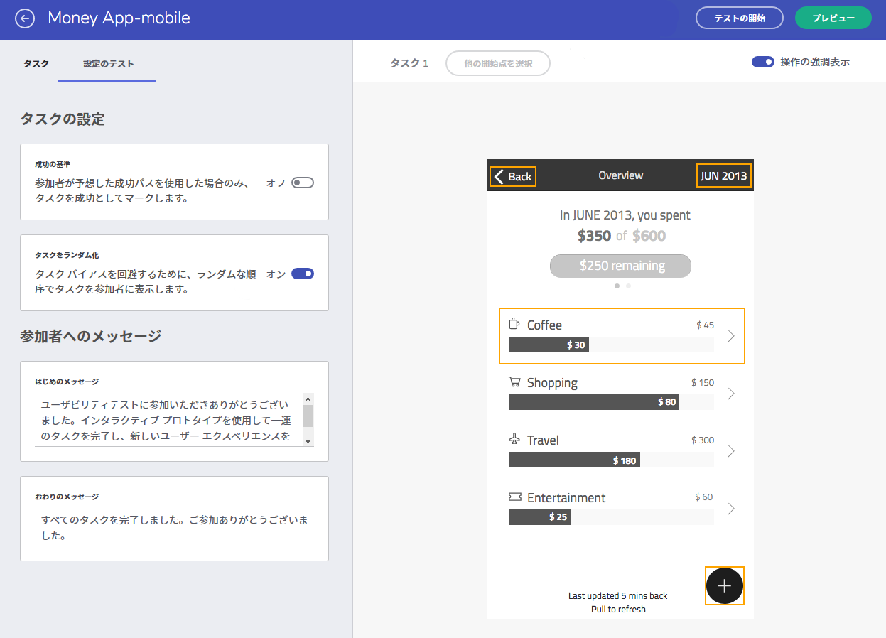
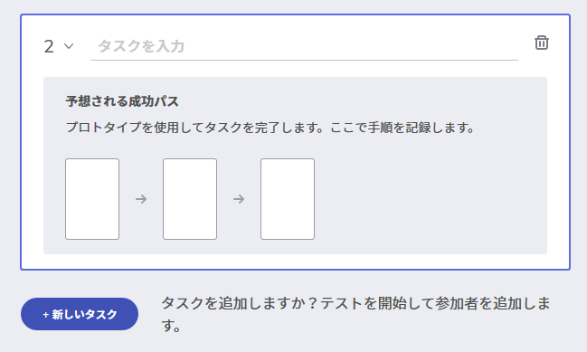
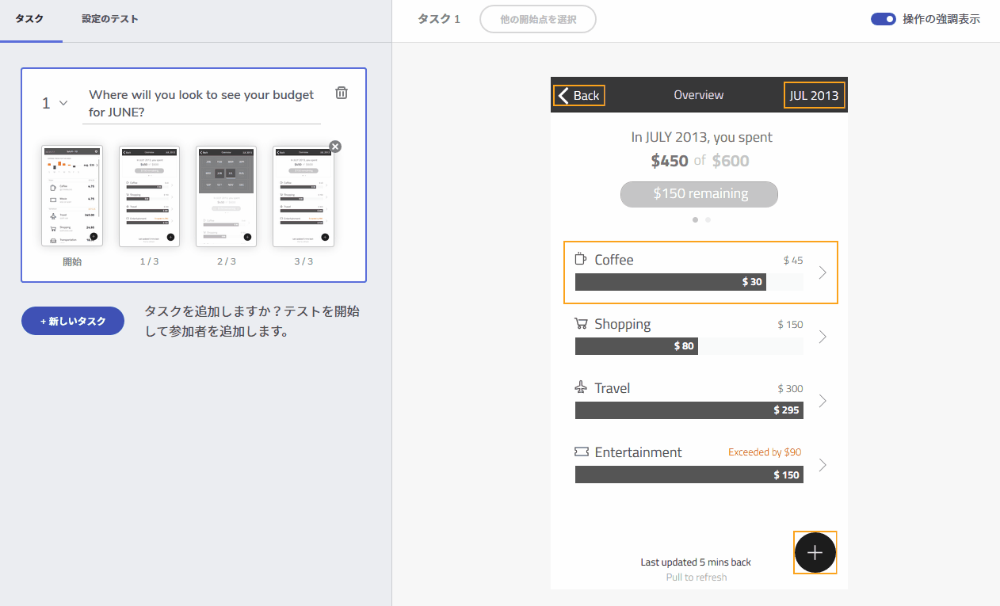
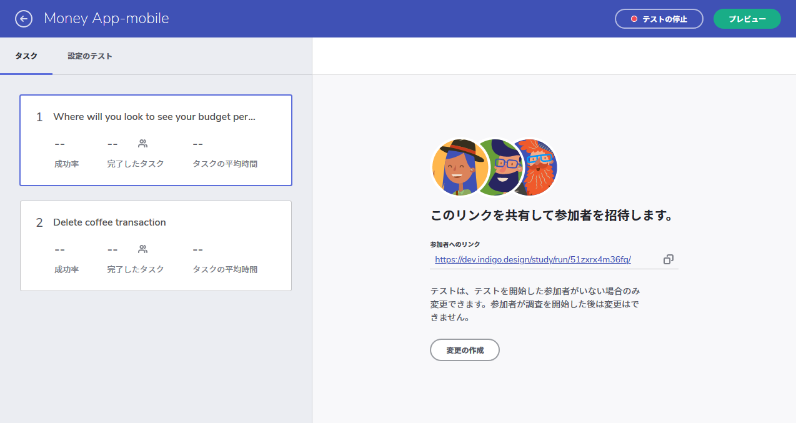

---
title: ユーザー テストの作成
_description: プロトタイプに基づいてユーザー テストを作成します。
_keywords: UX デザイン, プロトタイプ, コメント, ユーザビリティ テスト, ユーザー テスト
_language: ja
---

## ユーザー テストの作成

ワークスペースのプロトタイプに基づいてユーザビリティ テストを作成します。

 

## 概要

1. [ユーザビリティ テストの作成](#1-ユーザビリティ-テストの作成).
2. [タスクの定義](#2-タスクの定義).
3. [参加者の招待](#3-参加者の招待).

##  ステップバイステップ

### 1. ユーザビリティ テストの作成

1. ワークスペースでプロトタイプを特定し、`新しいユーザビリティ テスト` オプションをクリックします。
  

 

2. オプションとしてで、テストの前後に表示するメッセージを追加できます。ウェルカム メッセージはテストを始める前に参加者に表示されるメッセージです。お礼文は、参加者がテストを完了した後に送信されます。たとえば、テスト後にアンケートの回答を促すこともできます。

 

> [!Note]
> cloud.indigo.design にサインイン中にナビゲーション バーの`ユーザビリティ テスト`を選択し、すべての調査を表示および管理できます。

### 2. タスクの定義

ユーザビリティ テストを開始するには、少なくともタスクが 1 つ必要です。

1. タスクを追加するために`新しいタスクの追加`をクリックします。説明を追加します。

 

2. プロトタイプを操作して、タスクを完了するための想定されるパスを定義します。間違えた場合は直前の手順をやり直すことができます。

 

3. パスの記録が完了した後、`新しいタスクの追加`オプションを使用してさらに追加します。タスクを追加した後、参加者を招待します。
    
### 3. 参加者の招待

参加者を招待するには、メイン ツールバーの`テストの開始`オプションをクリックします。次に、生成された URL を共有し、Web ブラウザーを使用して参加します。

 

> [!Note]
> 参加者がテストを開始した後はテストを変更することはできません。

参加者数が必要数に達したらテストを終了し、それ以降参加を受け付けないようにもできます。
