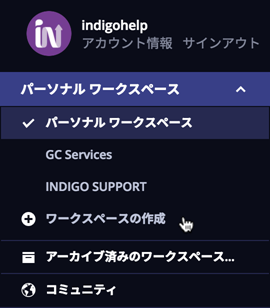
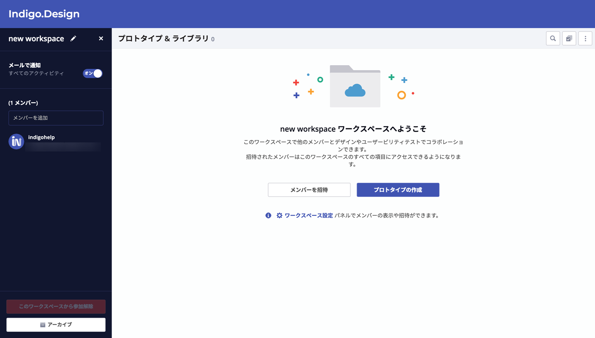
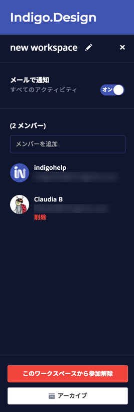

---
title: グループ ワークスペースを使用したコラボレーション
_description: グループ ワークスペースを使用して同僚とプロトタイプまたはユーザビリティ テストでコラボレーションを許可します。
_keywords: UX デザイン, プロトタイプ, コメント, ユーザビリティ テスト, ユーザー テスト
_language: ja
---

## ワークスペースを使用したコラボレーション

グループ ワークスペースを使用して同僚とプロトタイプまたはユーザビリティ テストでコラボレーションを許可します。メンバーはワークスペースのデザインを公開および置き換えることができます。メンバーが退会した場合も残りのメンバーがワークスペースの項目にアクセスすることができます。

[グループ ワークスペースの作成方法](https://www.youtube.com/watch?v=gLEf0IkYBFg)や[グループ ワークスペースを使用したコラボレーションの方法](https://www.youtube.com/watch?v=CdJS0gzPTPQ)も合わせてご覧ください。

### グループ ワークスペースの作成

ワークスペース ドロップダウンを展開して`グループ ワークスペースの作成`オプションをクリックします。

ワークスペースの名前を入力します。

メンバーを追加するには、メール アドレスを入力します。
メンバーとワークスペースをまだ共有する場合、そのメンバーはリストに表示されます。リストから選択すると、すぐにメンバーになります。それ以外の場合、ワークスペースに参加する招待を含むメールが送信されます。

### ワークスペースへのアクセス

ワークスペース ドロップダウンを展開し、使用するワークスペースの名前を選択します。そのワークスペースにあるすべてのプロトタイプが表示されます。

### グループ ワークスペースに公開

ワークスペースを選択した後、作成して公開するプロトタイプはそのワークスペースに含まれます。

> [!Note]
> 任意のプロトタイプを選択して`ワークスペースへコピー`操作で他のワークスペースに共有のコピーを作成できます。

### グループ ワークスペースの管理

ワークスペース ドロップダウンからワークスペースを選択し、ギア アイコンをクリックします。

オプション | 説明 |
------------- | -------------
ワークスペース名の編集 | 
通知を有効 / 無効にする | ワークスペースのアクティビティ情報のメール通知を開始または停止します。
メンバーの追加/招待 | リストからメンバーを選択して直接追加またはメール アドレスを入力して招待を送信します。
メンバーの削除 | 削除したメンバーはワークスペースへのアクセスおよびデザインの公開ができません。
ワークスペースから解除 | ワークスペースへのアクセスおよびデザインの公開ができなくなります。
ワークスペースのアーカイブ | メンバーはこのワークスペースに公開できません。すべてのメンバーがワークスペースを復元できます。

### 通知の設定

以下はワークスペース メンバーの場合に受信可能な通知のリストとその設定方法です。

通知内容 | 設定方法
------------- | -------------
ワークスペースへの招待 | 自動送信
ワークスペースに追加 |  自動送信
ワークスペースに公開 | ワークスペースの通知を有効に設定
共有アイテムの置き換え | ワークスペースの通知を有効に設定
共有アイテムの削除 | ワークスペースの通知を有効に設定
ワークスペースをアーカイブ | ワークスペースの通知を有効に設定
ワークスペース共有に新しいコメントの追加 | 共有アイテムの通知に登録
ワークスペースのユーザビリティ テストの新しい参加者 | ユーザビリティ テストの通知に登録

## 関連トピック

* [ユーザビリティ テストの作成](setting-up-a-usability-study.md)
