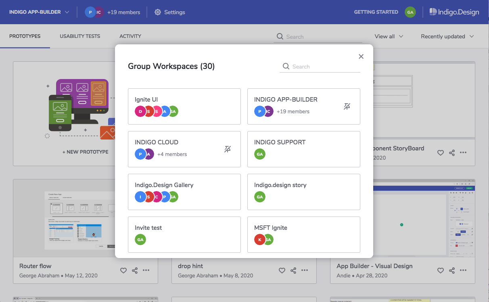
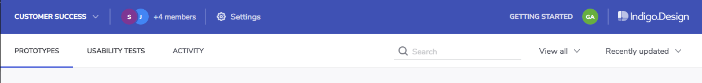

## ワークスペースを使用したコラボレーション

グループ ワークスペースを使用してプロトタイプやユーザビリティ テストでチームメンバーとコラボレーションします。メンバーはワークスペースのデザインの公開や置き換えができます。メンバーが退会した場合も残りのメンバーがワークスペースの項目にアクセスすることができます。

 

### グループ ワークスペースの作成

ワークスペース ドロップダウンを展開して `[+ 新しいグループ]` オプションをクリックします。 

ワークスペースの名前を入力します。 

メンバーを追加するには、メール アドレスを入力します。 
メンバーとワークスペースを既に共有している場合、そのメンバーがリストに表示されます。リストから選択して直ちにメンバーに追加できます。それ以外の場合、ワークスペースに参加するための招待メールが送信されます。

 

### ワークスペースへのアクセス

ワークスペース ドロップダウンを展開し、使用するワークスペースの名前を選択します。
そのワークスペースにあるすべてのプロトタイプとユーザビリティ テストが表示されます。

### グループ ワークスペースに公開

ワークスペースの選択後に作成、公開したプロトタイプはすべてそのワークスペースに含まれます。 

> [!NOTE]
>任意のプロトタイプを選択して`[ワークスペースへコピー]`操作で他のワークスペースにプロトタイプのコピーを作成できます。

### グループ ワークスペースの管理

ワークスペース ドロップダウンからワークスペースを選択し、メイン ツールバー領域で `[設定]` をクリックします。

オプション | 説明 |
------------- | -------------
ワークスペース名の編集 | 
メール通知を有効 / 無効にする | ワークスペースのアクティビティ情報のメール通知を開始または停止します。
メンバーの追加/招待 | リストからメンバーを選択して直接追加またはメール アドレスを入力して招待を送信します。
メンバーの削除 | 削除したメンバーはワークスペースへのアクセスおよびデザインの公開ができません。
ワークスペースから解除 | ワークスペースへのアクセスおよびデザインの公開ができなくなります。
ワークスペースのアーカイブ | メンバーはこのワークスペースに公開できません。すべてのメンバーがワークスペースを復元できます。

### 通知の設定

以下はワークスペース メンバーの場合に受信可能な通知のリストとその設定方法です。

通知内容 | 設定方法 
------------- | -------------
ワークスペースへの招待 | 自動送信 
ワークスペースに追加 |  自動送信
ワークスペースに公開 | ワークスペースの通知を有効に設定
プロトタイプの置き換え | ワークスペースの通知を有効に設定
プロトタイプの削除 | ワークスペースの通知を有効に設定
ワークスペースをアーカイブ | ワークスペースの通知を有効に設定
ワークスペース プロトタイプに新しいコメントの追加 | プロトタイプの通知に登録
ワークスペースのユーザビリティ テストの新しい参加者 | ユーザビリティ テストの通知に登録

## 関連トピック

* [ユーザビリティ テストの設定](setting-up-a-usability-study.md)

[a-1]: #グループ-ワークスペースの作成
[a-2]: #ワークスペースへのアクセス
[a-3]: #グループ-ワークスペースに公開
[a-4]: #グループ-ワークスペースの管理
[a-5]: #通知の設定
