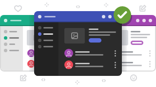
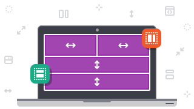

# ヒント 

### Sketch および Adobe XD 用の洗練された UI キット。
Sketch および Adobe XD 用の Indigo.Design UI キットでは、作成するものすべてがデザイン システムを使用していることをご存知ですか? すべてのスタイル設定の仕様およびテーマは、実際の Angular コンポーネントと一致します。400 個以上のアイコン、特別なカラー パレット、17 種類ののカスタマイズ可能なイラストなどがあります。[詳細はこちらをご覧ください](style/styling-overview.md)

### 無限のテーマ オプションとスタイル設定。
Material、Bootstrap、Fluent に基づいた 6 つのビルド済みテーマを使用し、ダークとライトのバージョンを用意しました。または、独自のデザイン言語に基づいて構築された Indigo テーマに切り替えます。アプリまたは企業のブランディングと一致しない場合は、テーマとスタイル設定オプションでカスタム テーマを作成できます。[詳細はこちらをご覧ください](sync-themes-plugin.md)

### インタラクティブ プロトタイプとユーザー テスト機能。 
Indigo.Design でインタラクティブ プロトタイプを作成し、任意のデバイスまたはプラットフォームで実際のユーザーとリモート ユーザー テストを実行できます。ユーザー インサイト、関係者とのシンプルなコラボレーション、ユーザーの行動に関する詳細な分析、ユーザー テストのビデオ録画とオーディオ録音を取得します。[詳細はこちらをご覧ください](prototyping/creating-a-prototype.md)

### デザインを Web アプリとして公開します。
プラグインの [アプリの作成] オプションを使用して、デザインのすべての UI キットコンポーネントをコード コンポーネントに変換し、アプリを公開します。Web ベースの WYSIWYG App Builder を使用してアプリの拡張すると、開発チームはエンタープライズ対応の Angular コードを生成できます。[詳細はこちらをご覧ください](appbuilder/app-builder-overview.md)

### 外部データ ソースをお持ちですか?
Indigo.Design App Builder には、任意の REST データ ソースへの接続や JSON ファイルのアップロードを可能にするデータ ソース オプションがあります。そのためには、データ ソース パネルに接続します。[詳細はこちらをご覧ください](appbuilder/using-data-in-your-app.md)

### アプリをゼロから作成する必要はありません。
作成済みの Sketch/XD ファイルから開始するか、60 以上の UI コントロールのツールボックスを使用してアプリケーション サンプルをダウンロードします。ワンクリックでデザインから高品質の HTML、CSS、Angular コードを生成できます。[詳細はこちらをご覧ください](components/components-overview.md)

### Indigo.Design App Builder が Flexbox を使用していることをご存知ですか?
Web アプリケーションのレイアウトを作成する方法の 1 つとして Flex を提供します。ツールボックスの行または列のレイアウト ンポーネントとして利用できます。ブラウザー間の互換性と、あらゆる画面サイズへの適応性が保証されています。[詳細はこちらをご覧ください](appbuilder/flex-layouts/flex-layouts.md)

### デザイン → ユーザー テスト → アプリのプレビュー。
デザインからコードまでのソリューションは、プロセス全体をカバーして効率化します。単一の作業環境でアプリケーションを 10 倍のスピードで開発し、コードを記述する前に完璧なピクセルのソリューションを実現できます。[詳細はこちらをご覧ください](getting-started.md)
