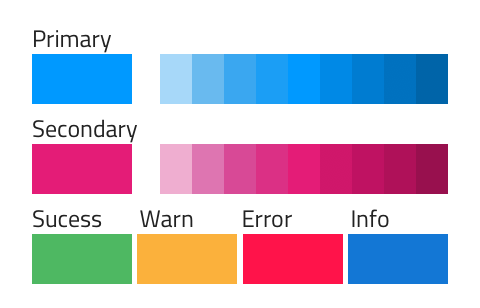
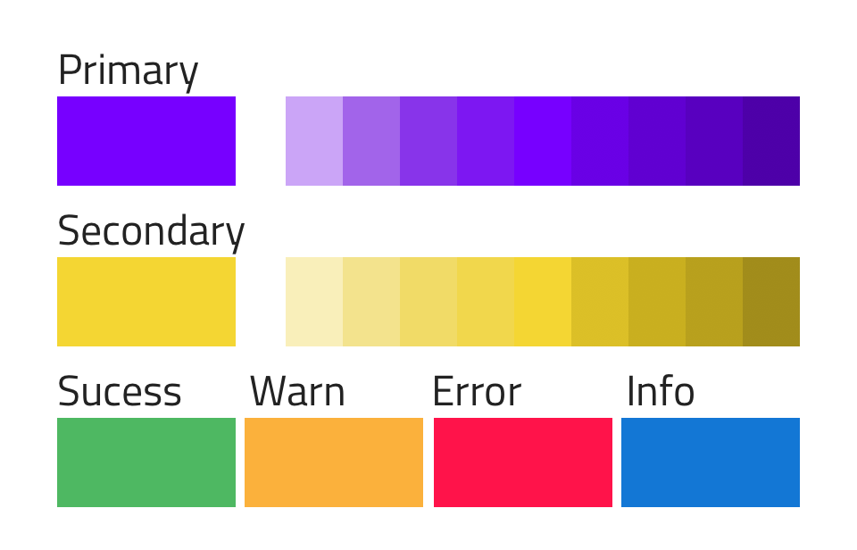
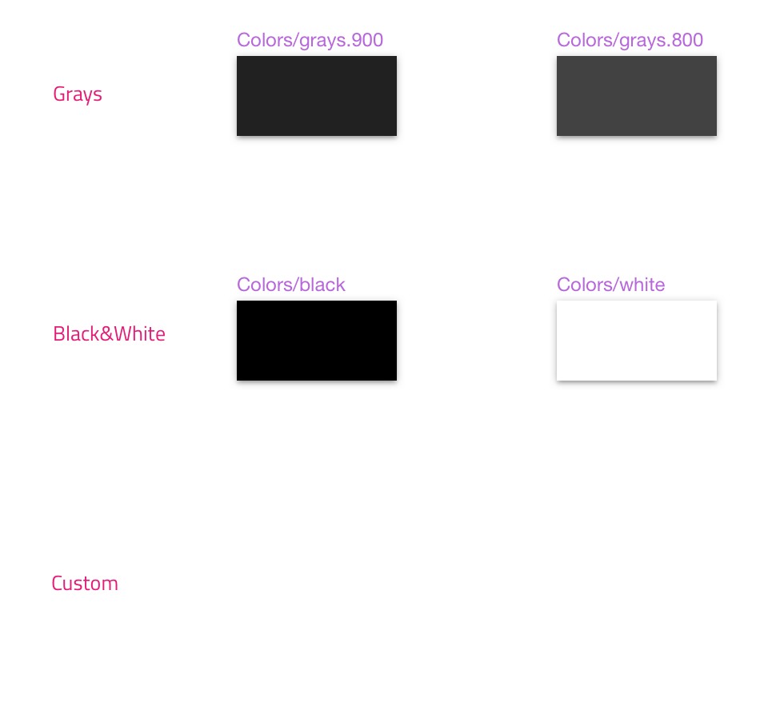
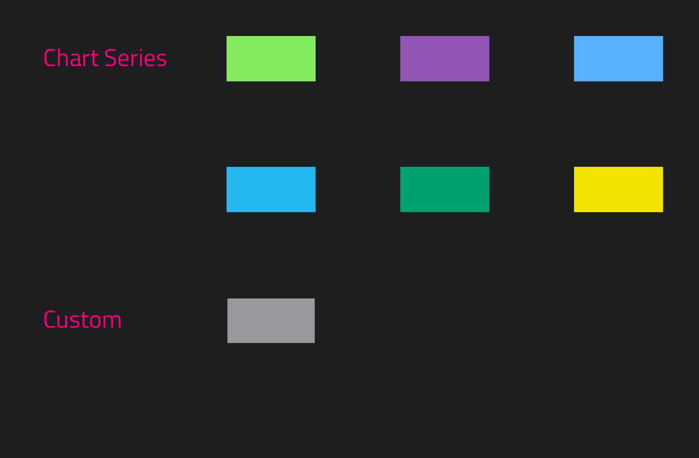
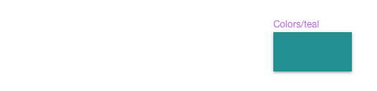

---
title: 色 - デザイン システム スタイリング
_description: スタイリングの色シンボルは、Indigo Design のテーマを設定できます。
_keywords: デザイン システム, Sketch, Ignite UI for Angular, UI ライブラリ, 色, パレット
_language: ja
---

## Colors

Colors はテーマ色 (`primary`、`secondary`、`success`、`warn`、`error`、`info`) を設定します。Styling ライブラリで Colors を設定する方法は、[Ignite UI for Angular Themes](https://jp.infragistics.com/products/ignite-ui-angular/angular/components/themes.html) と同じです。

### パレット生成

プライマリ カラーを変更するには、Sketch ファイルの `Colors` ページに移動し、`Primary 500` シンボルを適切な色に変更します。プライマリ パレット全体が直ちに更新されます。同じパレット生成が二次色にも使用できます。

> [!INFO]
> テキスト色は、デフォルト テーマをすべて更新する際に `Typography` で制御されるため、`Typography` ページの色を手動で変更する必要があります。プライマリ カラーを変更後、Typography の `Primary` セクションを同じ色に変更してください。手順の詳細は、[Typography](typography.md) をご確認ください。

### 色の追加

更にi色が必要な場合、パレット以外にカスタム色を追加することも可能で 2 通りの方法があります。

#### グローバル

ライブラリを使用するすべてのプロジェクトで追加した色を使用する場合、次の手順を使用します。

1.  Styling ライブラリを開き、`Colors` へ移動して色シンボルの `black`/`white`/`transparent` の行の下の空の `Custom` セクションにズームします。
    

2.  `Colors/black` シンボルを選択、次に `option` キーを押しながら以下のシンボルにドラッグし、コピーを作成します。
    

3.  `Colors/black` コピー シンボルの 唯一のレイヤーである `Rectangle` レイヤーを選択して、Fill の色を #008080 (teal) などに変更できます。`Colors/teal` などシンボルの名前も変更する必要があります。
    

4.  ライブラリで変更を保存し、追加した色はライブラリ メニューの色リストに表示されます。Components および Patterns ライブラリで色が使用されている場所に色オーバーライドに表示されます。

#### ローカル

2 つ目の方法は、ファイル特有の色の追加です。すべてのプロジェクトで使用することはできませんが作業しているプロジェクトで使用できます。次の簡単な手順に従います。

1.  既存の Sketch ファイルを開いて新しいページを作成し、ページ名を `Local Styles` にします。新しいページで Styling ライブラリから `Colors/black` 要素を挿入します。
    

2.  右クリックして`シンボルからデタッチ`を選択して `Rectangle` と呼ばれるレイヤーのみ含まれます。`Rectangle` レイヤーを選択して Fill の色を #008080 (teal) などに変更します。
    

3.  `シンボルからデタッチ`を選択して作成したグループ (以前のシンボル インスタンスと同じように `Colors/black` と呼ばれる) を選択し、メイン Sketch トップ メニューから `Create Symbol` ボタンをクリックして変更した色を色シンボルをオーバライドとして再度インスタンスを作成します。Iカスタム色 (`Colors/teal` など) の名前を選択するプロンプトが表示されます。Symbols Page チェックボックスのチェックは、OK ボタンをクリックする前に外されます。シンボルが作成され、以下のようになります。
    

4.  シンボル以外のティール色の四角形を削除して完了です。追加した色は、Document カテゴリの色のリストでローカル シンボルとして表示されます。現在のプロジェクトで色が使用できる Components および Patterns のすべてのインスタンスの `Document/Colors` の色オーバーライドにも表示されます。
    

## コードの生成

Sketch 描画に追加される色スタイル オブジェクトは相対する色およびサイズの HTML div 要素として描画されます。

## その他のリソース

関連トピック:

- [Typography](typography.md)
  

コミュニティに参加して新しいアイデアをご提案ください。

- [Indigo Design **GitHub** (英語)](https://github.com/IgniteUI/design-system-docfx)
