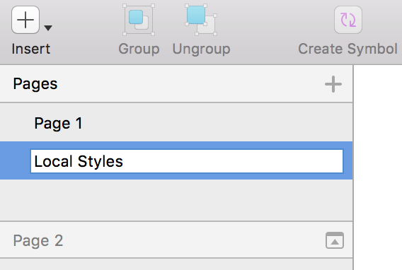

---
title: カラー - デザイン システム スタイリング
_description: スタイリングのカラー シンボルは、Indigo Design のテーマを設定できます。
_keywords: デザイン システム, Sketch, Ignite UI for Angular, UI ライブラリ, カラー, パレット
_language: ja
---

## カラー

スタイリング ライブラリ ファイルから Colors はテーマ カラー (`primary`、`secondary`、`success`、`warn`、`error`、`info`) を設定します。Styling ライブラリで Colors を設定する方法は、[Ignite UI for Angular テーマ](https://jp.infragistics.com/products/ignite-ui-angular/angular/components/themes.html) と同じです。

### パレット生成

プライマリ カラーを変更するには、Indigo-Styling の `Colors` ページに移動し、`Primary 500` シンボルを適切なカラーに変更します。プライマリ パレット全体が直ちに更新されます。同じパレット生成が二次色にも使用できます。

> [!Note]
> テキストカラーは、デフォルト テーマをすべて更新する際に `Typography` で制御されるため、`Typography` ページのカラーを手動で変更する必要があります。プライマリ カラーを変更後、Typography の `Primary` セクションを同じカラーに変更してください。手順の詳細は、[タイポグラフィ](typography.md) をご確認ください。

### カラーの追加

更にカラーが必要な場合、パレット以外にカスタム カラーを追加することも可能で 2 通りの方法があります。

#### グローバル

ライブラリを使用するすべてのプロジェクトで追加したカラーを使用する場合、次の手順を使用します。

1.  Styling ライブラリを開き、`Colors` へ移動してカラー シンボルの `black`/`white`/`transparent` の行の下の空の `Custom` セクションにズームします。

    

2.  `Colors/black` シンボルを選択、次に `option` キーを押しながら以下のシンボルにドラッグし、コピーを作成します。

    

3.  `Colors/black` コピー シンボルの 唯一のレイヤーである `Rectangle` レイヤーを選択して、Fill のカラーを #008080 (teal) などに変更できます。`Colors/teal` などシンボルの名前も変更する必要があります。

    

4.  ライブラリで変更を保存し、追加したカラーは `Insert` メニューの `Indigo-Styling/Colors` でカラー リストに表示されます。Components および Patterns ライブラリでカラーが使用されている場所にカラー オーバーライドに表示されます。

#### ローカル

2 つ目の方法は、ファイル特有のカラーの追加です。すべてのプロジェクトで使用することはできませんが作業しているプロジェクトで使用できます。次の簡単な手順に従います。

1.  既存の Sketch ファイルを開いて新しいページを作成し、ページ名を `Local Styles` にします。

    

2.  新しいページで Styling ライブラリから `Colors/black` 要素を挿入します。

    

3.  右クリックして `Detach from Symbol` を選択して `Rectangle` と呼ばれるレイヤーのみ含まれます。`Rectangle` レイヤーを選択して Fill のカラーを #008080 (teal) などに変更します。

    

4.  `Detach from Symbol` を選択して作成したグループ (以前のシンボル インスタンスと同じように `Colors/black` と呼ばれる) を選択し、メイン Sketch トップ メニューから `Create Symbol` ボタンをクリックして変更したカラーをカラー シンボルをオーバライドとして再度インスタンスを作成します。カスタムカラー (`Colors/teal` など) の名前を選択するプロンプトが表示されます。Symbols Page チェックボックスのチェックは、OK ボタンをクリックする前に外されます。シンボルが作成され、以下のようになります。

    

5.  シンボル以外のティールカラーの四角形を削除して完了です。追加したカラーは、Document カテゴリのカラーのリストでローカル シンボルとして表示されます。現在のプロジェクトでカラーが使用できる Components および Patterns のすべてのインスタンスの `Document/Colors` のカラー オーバーライドにも表示されます。

    

## コードの生成

Sketch 描画に追加されるカラー スタイル オブジェクトは相対するカラーおよびサイズの HTML div 要素として描画されます。

ブランディング用に `primary`、`secondary`、`success`、`warn`、`error`、および `info` カラー シンボルをカスタマイズすると、生成されたコードに同様の外観を保存します。[Ignite UI for Angular](https://jp.infragistics.com/products/ignite-ui-angular) のテーマでコードによって実装できます。カラー パレットを作成して追加する方法の詳細については、「[テーマ](https://jp.infragistics.com/products/ignite-ui-angular/angular/components/themes.html#色パレットの生成)」トピックをご覧ください。スタイリング ライブラリから Colors の正しい HEX 値を挿入してください。

## その他のリソース

関連トピック:

- [タイポグラフィ](typography.md)
  

コミュニティに参加して新しいアイデアをご提案ください。

