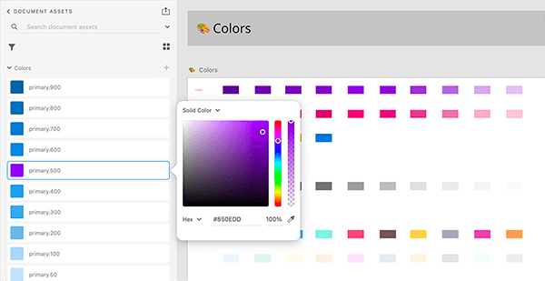
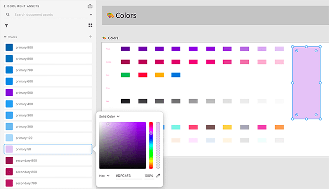
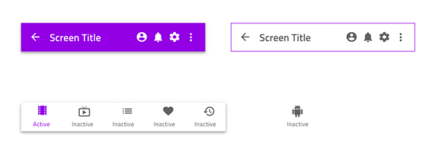
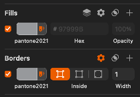
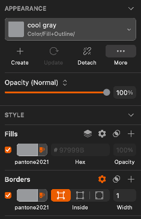
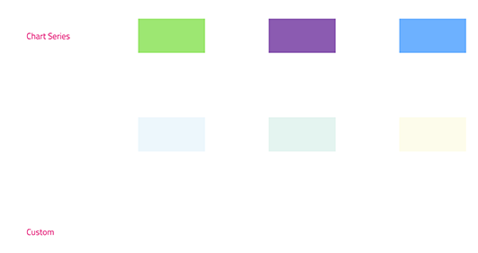
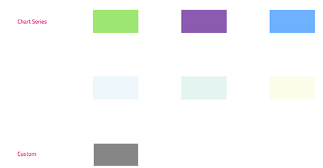
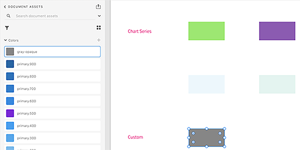

# Colors (カラー)

*There are five palettes with 10 color variations each for the `primary`, `secondary`, `grays`, and two chart `series` colors, as well as special colors such as `success`, `warn`, `error`, `info`, and `surface` in the **Indigo.Design System**. This lets you change the complete look of the library and all projects that use it with just a few clicks. Colors の設定方法は、[Ignite UI for Angular テーマ](https://jp.infragistics.com/products/ignite-ui-angular/angular/components/themes.html)と同じです。

In Sketch, these can be found on a separate page named `🎨 Colors` and are available as `Layer Styles` that can be applied to any shape element. In Adobe XD they are placed on an Artboard with the same name in the left column of the library file and exist as `Colors` that are used across components and patterns.

The **Indigo.Design System** features special color palettes optimized for various data visualization scenarios. Both ensure good contrast between adjacent series colors so that the palette can be used e.g. to colorize ranges of a gauge. One of the palettes is further optimized to be 100% inclusive and facilitate easy comprehension by people with color blindness deficiencies. 

## Sketch でのパレット生成

Sketch でプライマリ パレットを変更するには、Indigo.Design ライブラリ ファイルを開き、`View` / `Components` を選択します。Sketch メニューで 4 つのボタンのグループがあります。右側のボタンはパントーン ガイドのアイコンで、`Show Color Variables` を表します。

以下のキャンバスで、ライブラリで定義したすべてのカラー変数を表す色付きの円のコレクションが表示されます。`primary` と呼ばれるカラーを選択し、右側のパネルで別のカラーを指定します。この変更はプライマリ パレットのすべてのバリアントと `Layer Styles` を更新するだけでなく、これらの変更をすべてのコンポーネントとパターンに自動的に反映します。

ライブラリで `secondary` カラーや特別な意味を持つ他のカラーにも同じ手順を実行できます。

## Palette Generation in Adobe XD

To change the primary palette in Adobe XD open the Indigo.Design library file and show the `Libraries` panel. Then, right-click on `primary.500` and choose `Edit` from the contextual menu that appears to specify a different color. You will notice that this will update the palette on the `🎨 Colors` artboard, but only the `primary.500` color in the `Libraries` panel will reflect the change.

The rest of the colors in the `Libraries` panel have to be updated manually. To achieve this, draw a rectangle and use the eyedropper tool to set its fill by picking a color variant from the palette on the `🎨 Colors` artboard. Then use the hex value to edit the respective color in the `Libraries` panel. Follow this process until the whole palette is updated.

The same procedure can be followed for the `secondary` colors and other colors with special meaning in the library. This will propagate to components and patterns automatically.

## Sketch でカスタム カラーを作成

利用可能なカラーよりも多くのカラーが必要な場合があります。スコープが異なるカスタム カラーを作成するには、2 つの方法があります。

ライブラリを使用するすべてのプロジェクトで追加したカラーを使用したい場合、ライブラリの `Colors` ページに移動し、`series` パレットの下の空の `Custom` セクションにズームします。

プロセスを完了するには以下の手順に従ってください。現在のプロジェクトのスコープ内でのみ追加したカラーにアクセスできるようにするには、プロジェクトのページから以下の手順を実行します。

1.  四角形を描画し、塗りつぶしを任意のカラーに設定します。

    

2.  選択内容に問題がなければカラー ピッカーの `Create Color Variable` ボタンを選択します。

    

3.  四角形の境界線に同じカラー変数を適用し、`cool grey` などの名前を付けます。

    

4.  カスタム カラー四角形を使用して 3 つのカラー スタイルを作成する必要があります: 塗りつぶしのみのスタイル、境界線のみのスタイル、両方に名前を付けるスタイル。

    

5.  これでカスタム カラーがカラー変数として表示され、コンポーネントおよびパターンのオーバーライドに表示されます。

## Creating Custom Colors in Adobe XD

There are cases where we need more colors than the ones we have available. There are two approaches for creating custom colors that differ in terms of the scope we do this for.

If you want your added colors to be available across all the projects that use the library, navigate to the `Colors` artboard in it, and zoom to the empty `Custom` section underneath the `series` palettes.

Then complete the steps below to finish the process. If you want your added colors to be accessible only within the scope of your current project, follow the steps below from anywhere in it.

1.  Draw a rectangle and set its fill to the color of your choice. 

    

2.  Then, in the `Libraries` panel, click on the `+` icon to the right of `Colors` to create the style and give it an appropriate name.

    

3.  You are all set, your custom color will appear as a `Color` in the `Libraries` panel, and you can use it like any other color with your Components and Patterns.

## その他のリソース

関連トピック:

- [Elevation](elevation.md)
- [Typography](typography.md)
  

コミュニティに参加して新しいアイデアをご提案ください。
