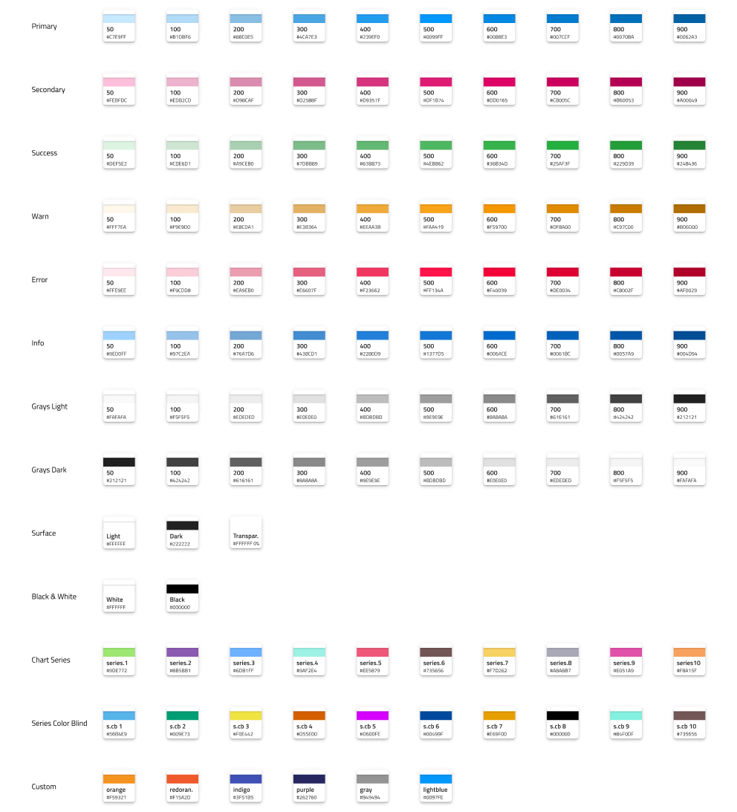
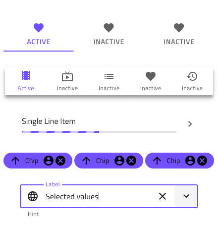
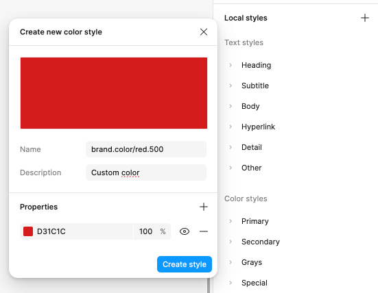

# Colors (カラー)

**Indigo.Design システム** には、`primary`、`secondary`、`grays` にそれぞれ 10 カラーのバリエーションを持つ 5 つのパレット、2 つのチャート `series` カラー、および `success`、`warn`、`error`、`info`、`surface` などの特別なカラーがあります。Figma には、`success`、`warn`、`error` および `info` の各状態に応じた 10 色のカラー バリエーションもあります。これにより、数回クリックするだけで、ライブラリとそれを使用するすべてのプロジェクトの完全な外観を変更できます。Colors の設定方法は、[Ignite UI for Angular テーマ](https://jp.infragistics.com/products/ignite-ui-angular/angular/components/themes.html)と同じです。

Figma では、これらは `↳ Colors` という別のページに配置されており、右側のサイドバーの [Design] タブの下にある Color Styles を通じて任意の形状要素に適用できます。

**Indigo.Design システム** は、さまざまなデータ視覚化シナリオ用に最適化された特別なカラー パレットを備えています。どちらも隣接するシリーズ カラー間の良好なコントラストを保証するため、パレットを使用して、たとえばゲージの範囲にカラーを付けすることができます。パレットの 1 つは完全に包括的になるように最適化されており、色覚異常のある人がでも簡単に理解できるようになっています。

## Figma でのパレット生成

Figma のプライマリ パレットを変更するには、まず **Indigo.Design UI キット** ファイルを開く必要があります。プロパティ パネルに `Color styles` というセクションが表示されます。カラー スタイルは、さまざまなカラー バリエーションを表すさまざまなカテゴリに分類されています。

カラーを変更するには、カラーの名前の右側にある `Edit style` アイコンをクリックします。ダイアログが表示され、新しいカラーを指定できます。

必要な変更を加えた後、カラー スタイルは現在それを使用しているすべての要素に自動的に適用されます。

この手順は、**Indigo.Design System** で使用可能な各カラー スタイルに適用できます。

## Figma でカスタム カラーを作成

利用可能なカラーよりも多くのカラーが必要な場合があります。スコープが異なるカスタム カラーを作成するには、2 つの方法があります。

追加したカラーに現在のプロジェクトのスコープ内でのみアクセスできるようにする場合は、プロジェクト内にローカル スタイルを作成できます。これを行うには、プロパティ パネルにある [Local styles] セクションの右側にあるプラス ボタンに移動します。新しいコンテキスト メニューが表示され、`Color` を選択する必要があります。

新しいダイアログが表示され、新しいカラーを設定し、デザイン プロジェクトでのカラーの使用に関連する名前と説明を付けることができます。

追加したカラーをチームのすべてのユーザーが使用できるようにするには、**Indigo.Design UI キット** ファイルで新しいスタイルを作成する必要がありますが、今回は `Custom` カラーに追加する必要があります。その後、変更を公開してチームがアクセスできるようにする必要があります。

## その他のリソース

関連トピック:

- [Elevation](elevation.md)
- [Typography](typography.md)
  

コミュニティに参加して新しいアイデアをご提案ください。
