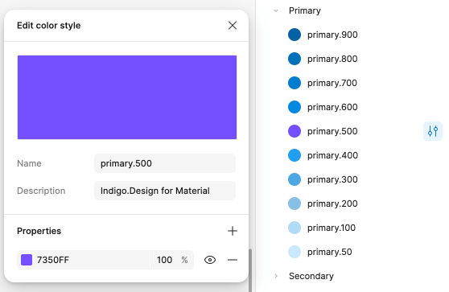

# Colors (カラー)

**Indigo.Design システム** には、`primary`、`secondary`、`grays` にそれぞれ 10 カラーのバリエーションを持つ 5 つのパレット、2 つのチャート `series` カラー、および `success`、`warn`、`error`、`info`、`surface` などの特別なカラーがあります。Figma には、`success`、`warn`、`error` および `info` の各状態に応じた 10 色のカラー バリエーションもあります。これにより、数回クリックするだけで、ライブラリとそれを使用するすべてのプロジェクトの完全な外観を変更できます。Colors の設定方法は、[Ignite UI for Angular テーマ](https://jp.infragistics.com/products/ignite-ui-angular/angular/components/themes.html)と同じです。

Figma では、これらは `↳ Colors` という別のページに配置されており、右側のサイドバーの [Design] タブの下にある Color Styles を通じて任意の形状要素に適用できます。Sketch では、これらは `🎨 Colors` という名前の別のページにあり、任意の図形要素に適用できる `Layer Styles` として利用できます。Adobe XD では、ライブラリ ファイルの左側の列にある同じ名前のアートボードに配置され、コンポーネントやパターン全体で使用される `Colors` として存在します。

**Indigo.Design システム** は、さまざまなデータ視覚化シナリオ用に最適化された特別なカラー パレットを備えています。どちらも隣接するシリーズ カラー間の良好なコントラストを保証するため、パレットを使用して、たとえばゲージの範囲にカラーを付けすることができます。パレットの 1 つは完全に包括的になるように最適化されており、色覚異常のある人がでも簡単に理解できるようになっています。

## Figma でのパレット生成

Figma のプライマリ パレットを変更するには、まず **Indigo.Design UI キット** ファイルを開く必要があります。プロパティ パネルに `Color styles` というセクションが表示されます。カラー スタイルは、さまざまなカラー バリエーションを表すさまざまなカテゴリに分類されています。

カラーを変更するには、カラーの名前の右側にある `Edit style` アイコンをクリックします。ダイアログが表示され、新しいカラーを指定できます。

必要な変更を加えた後、カラー スタイルは現在それを使用しているすべての要素に自動的に適用されます。

この手順は、**Indigo.Design System** で使用可能な各カラー スタイルに適用できます。

## Sketch でのパレット生成

Sketch でプライマリ パレットを変更するには、Indigo.Design ライブラリ ファイルを開き、`View` / `Components` を選択します。Sketch メニューで 4 つのボタンのグループがあります。右側のボタンはパントーン ガイドのアイコンで、`Show Color Variables` を表します。

以下のキャンバスで、ライブラリで定義したすべてのカラー変数を表す色付きの円のコレクションが表示されます。`primary` と呼ばれるカラーを選択し、右側のパネルで別のカラーを指定します。この変更はプライマリ パレットのすべてのバリアントと `Layer Styles` を更新するだけでなく、これらの変更をすべてのコンポーネントとパターンに自動的に反映します。

ライブラリで `secondary` カラーや特別な意味を持つ他のカラーにも同じ手順を実行できます。

## Adobe XD でのパレット生成

Adobe XD のプライマリ パレットを変更するには、Indigo.Design ライブラリ ファイルを開き、`Libraries` パネルを表示します。次に、`primary.500` を右クリックし、表示されるコンテキスト メニューから `Edit` を選択して、別のカラーを指定します。これにより、`🎨 Colors` アートボードのパレットが更新されますが、`Libraries` パネルの `primary.500` カラーのみが変更を反映します。

`Libraries` パネルの残りのカラーは手動で更新する必要があります。これを実現するには、長方形を描画し、アイドロッパー ツールを使用して、`🎨 Colors` アートボードのパレットからカラー バリエーションを選択して塗りつぶしを設定します。次に、hex 値を使用して、`Libraries` パネルでそれぞれのカラーを編集します。パレット全体が更新されるまで、このプロセスに従います。

ライブラリで `secondary` カラーや特別な意味を持つ他のカラーにも同じ手順を実行できます。これは、コンポーネントとパターンに自動的に伝達します。

## Figma でカスタム カラーを作成

利用可能なカラーよりも多くのカラーが必要な場合があります。スコープが異なるカスタム カラーを作成するには、2 つの方法があります。

追加したカラーに現在のプロジェクトのスコープ内でのみアクセスできるようにする場合は、プロジェクト内にローカル スタイルを作成できます。これを行うには、プロパティ パネルにある [Local styles] セクションの右側にあるプラス ボタンに移動します。新しいコンテキスト メニューが表示され、`Color` を選択する必要があります。

新しいダイアログが表示され、新しいカラーを設定し、デザイン プロジェクトでのカラーの使用に関連する名前と説明を付けることができます。

追加したカラーをチームのすべてのユーザーが使用できるようにするには、**Indigo.Design UI キット** ファイルで新しいスタイルを作成する必要がありますが、今回は `Custom` カラーに追加する必要があります。その後、変更を公開してチームがアクセスできるようにする必要があります。

## Sketch でカスタム カラーを作成

利用可能なカラーよりも多くのカラーが必要な場合があります。スコープが異なるカスタム カラーを作成するには、2 つの方法があります。

ライブラリを使用するすべてのプロジェクトで追加したカラーを使用したい場合、ライブラリの `Colors` ページに移動し、`series` パレットの下の空の `Custom` セクションにズームします。

プロセスを完了するには以下の手順に従ってください。現在のプロジェクトのスコープ内でのみ追加したカラーにアクセスできるようにするには、プロジェクトのページから以下の手順を実行します。

1.  四角形を描画し、塗りつぶしを任意のカラーに設定します。

    

2.  選択内容に問題がなければカラー ピッカーの `Create Color Variable` ボタンを選択します。

    

3.  四角形の境界線に同じカラー変数を適用し、`cool gray` などの名前を付けます。

    

4.  カスタム カラー四角形を使用して 3 つのカラー スタイルを作成する必要があります: 塗りつぶしのみのスタイル、境界線のみのスタイル、両方に名前を付けるスタイル。

    

5.  これでカスタム カラーがカラー変数として表示され、コンポーネントおよびパターンのオーバーライドに表示されます。

## Adobe XD でカスタム カラーを作成

利用可能なカラーよりも多くのカラーが必要な場合があります。スコープが異なるカスタム カラーを作成するには、2 つの方法があります。

ライブラリを使用するすべてのプロジェクトで追加したカラーを使用したい場合、ライブラリの `Colors` アートボードに移動し、`series` パレットの下の空の `Custom` セクションにズームします。

プロセスを完了するには以下の手順に従ってください。現在のプロジェクトのスコープ内でのみ追加したカラーにアクセスできるようにするには、プロジェクト内のどこからでも以下の手順に従います。

1.  四角形を描画し、塗りつぶしを任意のカラーに設定します。

    

2.  次に、`Libraries` パネルで、`Colors` の右側にある `+` アイコンをクリックしてスタイルを作成し、適切な名前を付けます。

    

3.  これですべての設定が完了し、カスタム カラーが `Libraries`パネルに `Color` として表示され、コンポーネントやパターンで他のカラーと同じように使用できます。

## その他のリソース

関連トピック:

- [Elevation](elevation.md)
- [Typography](typography.md)
  

コミュニティに参加して新しいアイデアをご提案ください。
