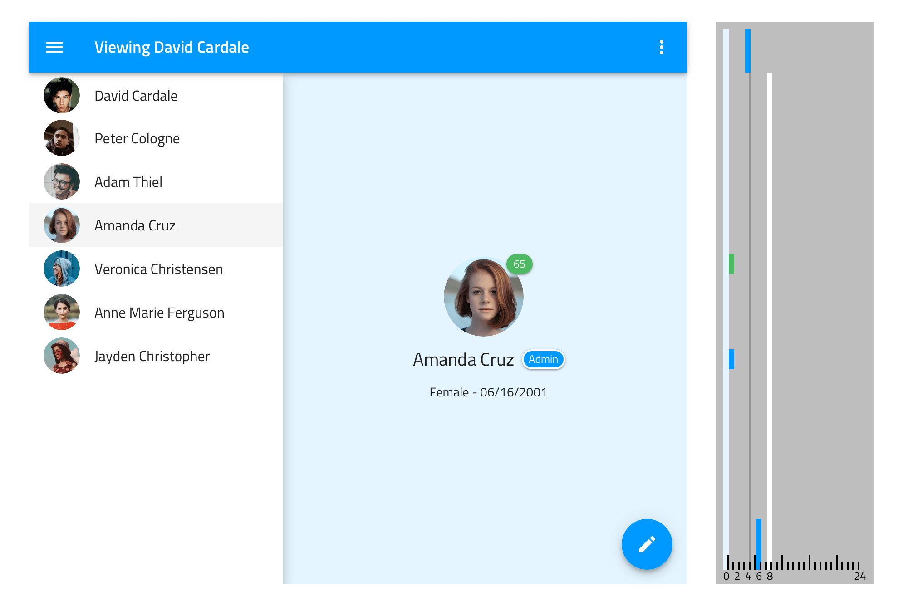
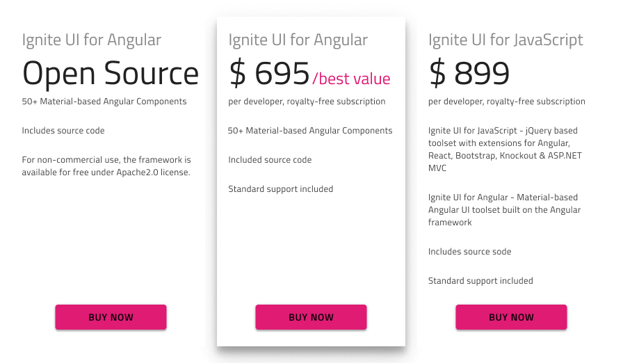

# エレベーション

**Indigo.Design システム**の `🎨 Elevation` ページで、コンポーネントとパターンで 24 のエレベーションが使用され、基になるコンテンツに影を表示します。Bottom Navigation や Floating Action Button などのコンポーネントは視覚的な階層を確立しますが、Registration または Login Form などの特定の要素をフロートさせることにも利用できます。エレベーションは、[マテリアル デザイン エレベーション](https://material.io/design/environment/elevation.html#) および [Ignite UI for Angular Shadows](https://jp.infragistics.com/products/ignite-ui-angular/angular/components/shadows.html) と同じです。

## エレベーションのサポート

エレベーションは単純なロジックに従っています。エレベーションの数値が大きくなると、シャドウがより暗く表示されます。シャドウは umbra、penumbra、および ambient の 3 つが重なったシャドウ カラーの組み合わせで値はマテリアル デザインの定義と一致します。Sketch でエレベーションは、任意の図形に適用できるレイヤー スタイルとして利用できます。レイヤー スタイルを使用するコンポーネントでは、このスタイルをマスク レイヤーまたは特別に指定された `Elevation` 四角形である正しいレイヤーに適用します。

> [!Note]
> コンポーネントのスタイルを変更してエレベーションを変更することは Sketch で可能ですが、現在 Ignite UI for Angular では実装されていません。

## スタンドアロン エレベーションの使用

エレベーションを単独で使用してコンテンツの一部を持ち上げて残りの部分よりもフォーカスする場合、コンテンツのサイズに一致する四角形に選択したエレベーション レイヤー スタイルを適用します。

## その他のリソース

関連トピック:

- [Bottom navigation](../components/bottom-nav.md)
- [Button](../components/button.md)
- [Card](../components/cards.md)
- [Forms](../patterns/form.md)
  

コミュニティに参加して新しいアイデアをご提案ください。

