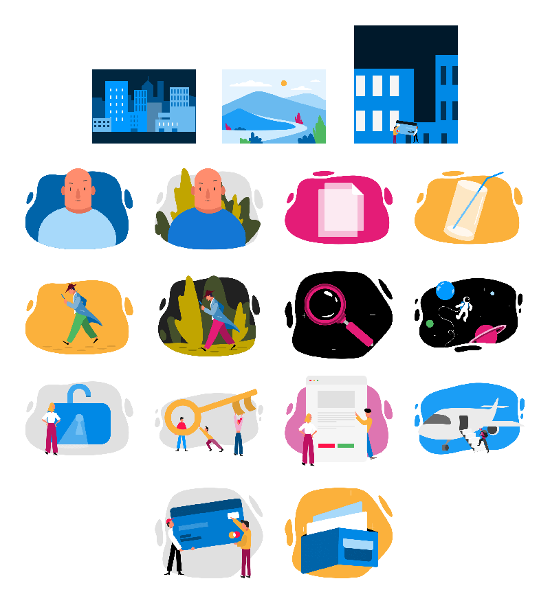

# イラストレーション

コンポーネントのレイアウトにより多くのコンテキストを提供し、主要な視覚要素でより快適で完成度の高い描画でインターフェイスを補完するために、Styling ライブラリ ファイルのイラストレーションを使用します。

## 色の使用

各イラストレーションでは、特定の要素に他の色を適用するおよび色を透明に設定して要素を非表示することで、特定のレベルのカスタマイズが可能です。特定の要素 (文字のスキン色など) は意図的にカスタマイズ不可能です。ただし、Styling ライブラリを開いて異なる色を適用することでこれらをグローバルに変更できます。

## コードの生成

> [!Warning]
> イラストレーションは、Indigo.Design の現在のバージョンではコード アセットを生成しません。これは [既知の問題](../known-issues.md) として報告されており、今後のリリースで実装される予定です。

## その他のリソース

関連トピック:

- [カラー](colors.md)
  

コミュニティに参加して新しいアイデアをご提案ください。
