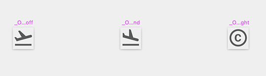
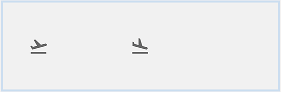
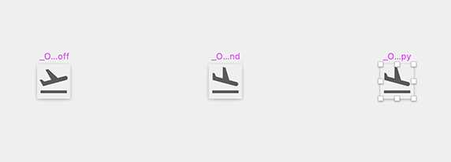
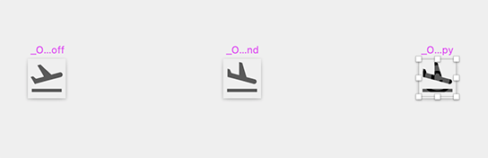
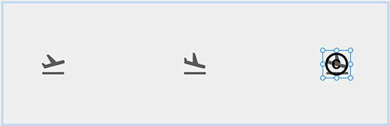
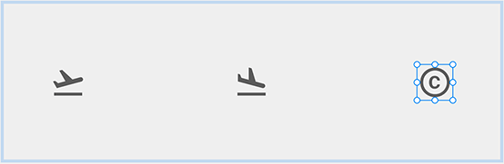
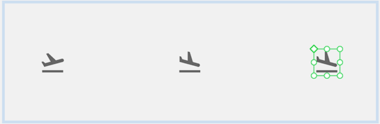
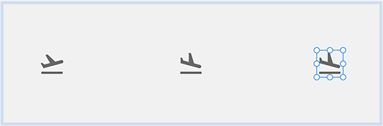
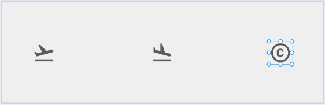
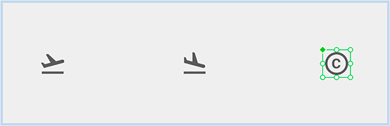

# Material Icons (マテリアル アイコン)

**Indigo.Design システム**に付属するマテリアル アイコンには、[マテリアル リソース](https://material.io/resources/icons/?style=baseline)からインポートされた 160 以上のアイコンと、[マテリアル システム アイコン ガイドライン](https://material.io/design/iconography/system-icons.html#design-principles)に従って **Indigo.Design システム**のチームによって作成された 360 個以上のアイコンがあります。Icon Buttons、List Items、Cards、など、で全般的な操作をシンボルとして表示するためにアイコンを使用します。たとえば、ラベルでテキストの代わりにアイコンを使用します。すべてのアイコンは [Ignite UI for Angular](https://jp.infragistics.com/products/ignite-ui-angular) でもサポートされます。

- **Figma** では、`Icons` というラベルの付いた専用ページ上のすべてのアイコンにアクセスできます。アイコンの外観は、事前定義された `Color styles` を使用してカスタマイズでき、デザインのニーズに合わせてカラーを調整できます。
- **Sketch** では、これらのグラフィックは `🎨 Material Icons` という名前の別のページにあり、それらのカラーは `Layer Styles` を介して定義され、作成中のデザインのアイコンの外観をカスタマイズできます。
- **Adobe XD** では、ライブラリ ファイルの左側の列の下部にある同じ名前のアートボードに配置され、左側の [Libraries] パネルの `Colors` を使用してカスタマイズできます。

> [!Note]
> ExtraLarge、Large、Medium、Small の 4 つのサイズを持つ専用の [Icon](../components/icon.md) コンポーネントもあります。アートボードに直接挿入する代わりに、`Icons` と `🎨 Material Icons` で使用可能なグリフの 1 つを割り当てる記事、カスタム Cards、List Items などの複雑なレイアウトを作成する場合に使用します。

## 利用可能な Material Icon

**Indigo.Design システム**には 160 以上の Material Icon のセットがあり、マテリアル デザインのカテゴリに基づいて以下のようにグループ化されています。

- Action
- Alert
- AV
- Communication
- Content
- Device
- Editor
- File
- Hardware
- Images
- Maps
- Navigation
- Notification
- Places
- Social
- Toggle
- WB

以下のカテゴリのために、元のマテリアル セットの拡張としてチームが作成した 360 以上の Material Icon のセットもあります。

- Construction
- Content
- Editor
- Elections
- Finance
- Health
- Logos
- Programming
- Social Media

これらのアイコンは、[GitHub](https://github.com/IgniteUI/material-icons-extended) でも利用できます。

## アイコンの追加

アイコンの定義済みコレクションを使用してコンポーネントおよびパターンにアイコンを分かりやすいシンボルとして追加できます。その他のアイコン セットの追加が可能ですが、現在のセットにその他の Material Icon を追加することもできます。[Ignite UI for Angular](https://jp.infragistics.com/products/ignite-ui-angular) で Material Icon がサポートされるため、アイコンを既存のセットに追加できます。ブラウザーで [マテリアル デザイン アイコン ツール](https://fonts.google.com/icons?selected=Material+Icons)に移動します。`Copyright` などに使用するアイコンを検索し、[SVG](https://fonts.google.com/icons?selected=Material+Icons&icon.query=copyright) としてダウンロードして属しているカテゴリを確認します。この場合、`Action` になります。

### Figma で

1.  Figma でライブラリを開き、`Icons` ページに移動して、左側のサイドバーのレイヤー パネルに同じカテゴリがフレームとして存在するかどうかを確認します。存在しない場合は作成して、以下の手順を行います。`Action` カテゴリの `copyright` アイコンの例のように存在する場合、そのカテゴリの最も右側にあるアイコンを検索します。以下のようなものになります: アイコンはすべてのカテゴリでアルファベット順に並べられていることに注意してください。

    

2.  このアイコンの Component をコピーして右へ移動します。その名前は複製したものと同じである必要があり、そのレイヤー構造は次のようになります: 

    | レイヤー                                                                             | 使用                                                                              |
    | --------------------------------------------------------------------------------- | -------------------------------------------------------------------------------- |
    | Icon name  | 	アイコン名をコンポーネントとして定義します。|
    | Color      | アイコンのグラフィック視覚化であるコンポーネント内のネストされたアイコン図形。|
    | Text layer | アイコン名をフレーム内の追加のテキストレイヤーとして表示します。|

    

3.  次に、既存のアイコン図形をダウンロードした SVG に置き換えたいので、Icon 名レイヤーを選択し、`copyright` アイコンを含む SVG をワークスペースにドラッグ アンド ドロップする必要があります。これにより、アイコン コンポーネントの上に SVG が配置され、見つけやすくなります。SVG をドロップすると、レイヤー パネルに新しいフレーム `copyright_black_24dp` が作成されます。これを展開して、目的のアイコンの図形を他のグループのすぐ外側に、ただし現在のフレーム内にドラッグする必要があります。その後、他の追加のグループを削除し、フレーム内にアイコン図形だけを残します。

    

4.  次に、その中に `Vector` シェイプがある `copyright_black_24dp` フレームを選択し、そのフレームからコンポーネントを作成する必要があります。これを行うには 2 つの簡単なオプションがあります。フレームを右クリックして `Create component` (コンポーネントの作成) オプションを選択するか、ワークスペースの中央にある Figma ツールバーの `Create component` アイコンをクリックします。次に、ベクター シェイプの名前を `Color` に変更し、右側のサイドバーの `Selection colors` からそのカラーを `grays.700` に設定します。

    
    

5.  それに応じてアイコンコンポーネント名を更新した後、それを複製したコンポーネントのコンポーネントと交換する必要があります。

    

6. 最後に、変更をライブラリの更新として公開する必要があります。サブスクライブしたファイルでこれらの変更を確認するには、変更を確認して受け入れる必要があります。

### Sketch で

1.  Sketch でライブラリを開き、`🎨 Material Icons` ページに移動して、同じカテゴリが左側のテキスト レイヤーとして存在するかどうかを確認します。存在しない場合は作成して、以下の手順を行います。`Action` カテゴリの `copyright` アイコンの例のように存在する場合、そのカテゴリの最も右側にあるアイコンを検索します。以下のようなものになります:

    
    

2.  このアイコンのシンボルをコピーして右へ移動します。名前は `...Copy` で終わり、レイヤー構造は以下のようになります。

    | レイヤー                                                                             | 使用                                                                              |
    | --------------------------------------------------------------------------------- | -------------------------------------------------------------------------------- |
    | Color | アイコンの図形とカラーを定義します。|
      Shape | 境界ボックスを定義する四角形です。 |

    

    
    

3.  既存のアイコン図形をダウンロードした SVG と置き換えます。カラー レイヤーを選択し、`copyright` アイコンの SVG をその上にドラッグ アンド ドロップします。これは `copyright-24px` の新しいグループをレイヤー パネルに作成します。このグループを展開し、アイコン図形をグループ以外で四角形の図形レイヤー上にドラッグします。

    
    

4.  新しいアイコン図形を移動した後、元のアイコン グリフおよびグループを削除します。次に、`copyright` シンボルで残したアイコン図形を選択し、名前を `Color` に変更し、Appearance を `grays.700` 塗りつぶしスタイルに設定する必要があります。

    
    

5.  シンボル名を更新した後、他のアイコンと同じようにこのアイコンを使用できます。

    
    

### Adobe XD で

1.  Adobe XD でライブラリを開き、`🎨 Material Icons` アートボードに移動して、同じカテゴリが左側のテキスト レイヤーとして存在するかどうかを確認します。存在しない場合は作成して、以下の手順を行います。`Action` カテゴリの `copyright` アイコンの例のように存在する場合、そのカテゴリの最も右側にあるアイコンを検索します。以下のようなものになります:

    
    

2.  このアイコンのシンボルをコピーして右へ移動します。これにより、インスタンスが選択されたときに左上角に緑色のアウトラインが付いた白いひし形で示されるシンボルのインスタンスが作成されます。

3.  このインスタンスのグループ化を解除し、2 つの新しいレイヤーから「_Overrides/Material Icons/action/copyright」という名前の新しいグループを作成します。

    | レイヤー | 使用 |
    | ----------------------- | ----------------------------------------------------- |
    | Group ~ | アイコンの図形と色を定義します。 |
    | Shape | 境界ボックスを定義する四角です。 |
    

    
    

4. 次に、既存のアイコン図形をダウンロードした SVG に置き換えます。そのため、古いグリフのある Group を選択し、その上に `copyright` アイコンが付いた SVG をドラッグアンドドロップして、2 つをすべての側に揃える必要があります。これにより、レイヤー パネルに新しいグループ `copyright-24px` が作成されます。このグループのすぐ外側で、長方形の Shape レイヤーの上にある目的のアイコン図形を展開してドラッグする必要があります。

    
    

5.  新しいアイコン図形を移動した後、元のアイコン グリフおよびグループを削除します。次に、`copyright` シンボルが付いた唯一のアイコン図形を選択し、[Libraries] パネルの [Colors] からその外観を `grays.700` に設定します。

    
    

6.  最後の手順は、_Overrides/Material Icons/action/copyright グループからコンポーネントを作成して、デザインの他のアイコン要素と同じように使用を開始できるようにすることです。

    
    

## その他のリソース

関連トピック:

- [Colors](colors.md)
- [Icon](../components/icon.md)

コミュニティに参加して新しいアイデアをご提案ください。
