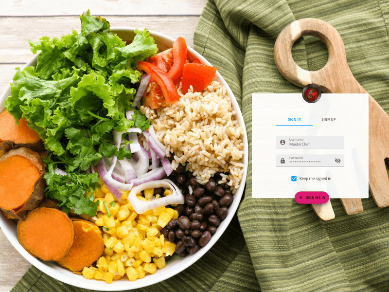

## The Theme Concept

All Components themselves map to Ignite UI for Angular components. The theming engine of Infragistics' Angular product, through powerful SASS functions and mixins, allows for the creation of custom color themes that can restyle the whole product in just few lines of code.

With the Sketch libraries, you're able to modify the NBL-Styling library to achieve the same results for both the Components and Patterns.

## NBL-Styling

NBL-Styling is the defacto representation of the theming engine. It is separated into four parts represented as different pages in the library: Icons, Colors, Typography and Elevations.

- [Material Icons](material-icons.md) - a collection of 100+ Material Icons, which you can easily extend
- [Colors](colors.md) - a palette consisting of primary, secondary and special colors, as well as shades of gray and levels of opacity
- [Typography](typography.md) - a collection of generic and component-specific text styles
- [Elevation](elevation.md) - the familiar set of 24 shadows used in [Material Design](https://material.io/design/environment/elevation.html) based on umbra, penumbra, and ambient shadow colors.

## Additional Resources

Related topics:

- [Material Icons](material-icons.md)
- [Colors](colors.md)
- [Typography](typography.md)
- [Elevation](elevation.md)
  

Our community is active and always welcoming to new ideas.

- [Indigo Design **GitHub**](https://github.com/IgniteUI/design-system-docfx)
