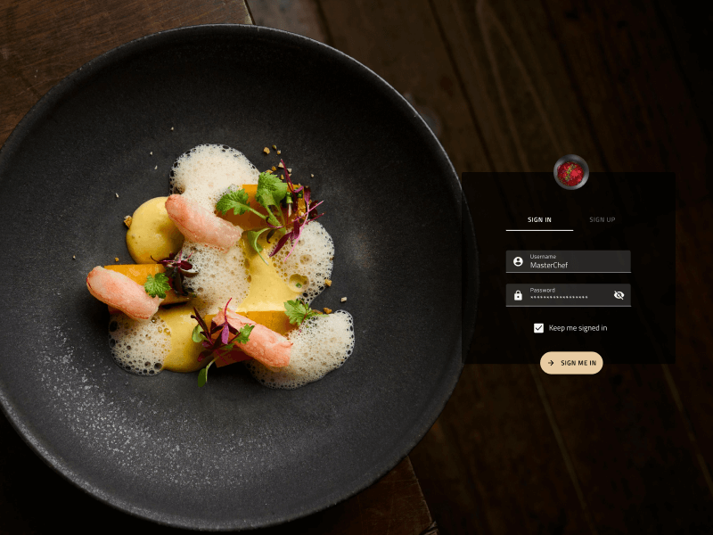

# スタイル設定の概要

**Indigo.Design システム**は、Ignite UI for Angular コントロールにもマップされる 60 以上のすべての UI コンポーネントをスタイリングする精巧な手段を提供します。Angular 製品のテーマ エンジンは数行のコードで製品全体のスタイルを変更できるカスタム カラー テーマを作成できます。[**App Builder**](https://jp.infragistics.com/products/appbuilder/help/app-builder-overview) もこれらのテーマ設定メカニズムを実装しており、ユーザーは数回クリックするだけでアプリの完全な外観を変更できます。

## Figma でのスタイル設定

Figma の `Indigo.Design for Material` ライブラリには、次のページ構造があります。

- ↳ Icons
- ↳ Colors
- ↳ Typography
- ↳ Elevation
- ↳ Illustrations

リストされているページは、`🧱 Foundation` ページの下にあります。Colors と Elevations は `Color styles` と `Effect styles` として存在し、Typography は `Text styles` として定義されているため、**Indigo.Design システム**で作成した特定のデザインのテーマをすばやく変更できます。

## Sketch でのスタイル設定

4 つの Sketch ライブラリ (`Indigo.Design for Material`、`Indigo.Design for Bootstrap`、`Indigo.Design for Fluent`、および `Indigo.Design for Indigo Theme`) はそれぞれ、アセットと、ライブラリの残りの部分が構築される強力なスタイリング インフラストラクチャを提供する 🎨 絵文字で始まるページの同じ構造を持っています。好みのデザイン言語に基づいてバリアントを選択した後、ライブラリの外観をカスタマイズするために以下のページに移動してください:

- 🎨 Material Icons (マテリアル アイコン)
- 🎨 Colors (カラー)
- 🎨 Typography (タイポグラフィ)
- 🎨 Elevation (エレベーション)
- 🎨 Illustrations (イラストレーション)

カラーとエレベーションは `Layer Styles` として存在し、タイポグラフィは `Text Styles` として定義されます。これにより、**Indigo.Design システム**で作成したデザインのテーマをすばやく変更できます。

## Adobe XD でのスタイル設定

Adobe XD ライブラリには、ライブラリの残りの部分が構築されている強力なスタイリング インフラストラクチャを紹介する 🎨 絵文字が前に付いたアートボードがいくつかあります。

- 🎨 Material Icons
- 🎨 Colors
- 🎨 Typography
- 🎨 Elevation
- 🎨 Illustrations

カラーは `Colors` として定義され、タイポグラフィは `Character Styles` として定義され、アイコン、エレベーション、イラストレーションは `Components` として存在します。これにより、**Indigo.Design システム**で作成した特定のデザインのテーマをすばやく変更できます。

詳細情報:

- [Material Icons](material-icons.md) - Material Icon のデザイン ガイドラインに基づいて作成された 360 以上のアイコンで拡張された 160 以上の Material Icon のコレクション。
- [Colors](colors.md) - primary、secondary、gray のカラー バリアントのパレット、特殊な色、さまざまなタイプの色覚異常に最適化されたセットを含むデータ可視化のために特別に設計されたいくつかのパレット。
- [Typography](typography.md) - ジェネリックおよびコンポーネント固有のテキスト スタイルのコレクション。
- [Elevation](elevation.md) - [Material Design](https://material.io/design/environment/elevation.html) の 24 影のセット。
- [Illustrations](illustrations.md) - デザインをより遊び心のあり完璧なものにする 17 種類のカスタマイズ可能なイラスト。

## その他のリソース

関連トピック:

- [Material Icons](material-icons.md)
- [Colors](colors.md)
- [Typography](typography.md)
- [Elevation](elevation.md)
- [Illustrations](illustrations.md)
- [コンポーネント](../components/components-overview.md)
- [パターン](../patterns/patterns-overview.md)

コミュニティに参加して新しいアイデアをご提案ください。
