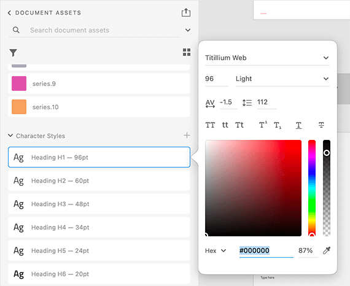
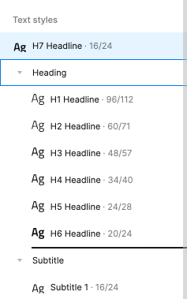
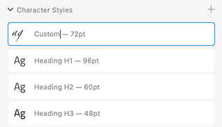

# Typography (タイポグラフィ)

**Indigo.Design システム**には、タイポグラフィを構成し、テーマの書体を設定できる 12 のテキスト （文字） スタイルがあります。デフォルトで [Titillium Web](https://fonts.google.com/specimen/Titillium+Web) を使用していますが、すべてのデザイナーがアプリケーションを柔軟にカスタマイズできるようにする必要があります。Indigo.Design は、[マテリアル タイプ システム](https://material.io/design/typography/the-type-system.html#type-scale)でタイポグラフィが定義されている方法に従い、[Ignite UI for Angular タイポグラフィ](https://jp.infragistics.com/products/ignite-ui-angular/angular/components/themes/typography)の実装に準拠しています。

Sketch では、これらは `🎨 Typography` という名前の別のページにあり、任意テキスト要素に適用できる `Text Styles` として利用できます。Adobe XD では、ライブラリ ファイルの左側の列にある同じ名前のアートボードに配置され、コンポーネントやパターン全体で使用される `Character Styles` として存在します。

## Typography のスタイル

プロジェクトでタイポグラフィ システムを使用するには、ライブラリで定義されているテキスト (文字) スタイルの 1 つをネイティブ テキスト要素に適用するだけです。Sketch は、さまざまなサイズ、カラー、および配置のタイプ プリセットの幅広い選択肢を提供しますが、Adobe XD はサイズのみを定義し、配置を調整してカラー スタイルを適用できます。

- タイトルの `H1` から `H6` までの 6 つの見出し。
- 2 つの `Subtitle` サイズ。
- 2 インターフェイスの段落コンテンツの `Body` サイズ。
- 無料のコンテンツに使用できる `Caption` と `Overline` スタイル。
- Button コンポーネントでのみ使用される `BUTTON` スタイル。

これらのスタイルは、アプリケーションの関連レイヤーに対して生成されるテキスト要素とタイポグラフィ クラスのタイプも決定します。以下の要素は、一般的なテキス トレイヤーに適用されるタイポグラフィ テキスト スタイルに基づいて生成されます。
- 見出しのタイポグラフィ スタイルの見出し `<h1>` から `<h6>`。
- タイポグラフィ クラスの段落 `
`:
  - 2 つの字幕タイポグラフィ スタイルの場合は、`igx-typography__subtitle-1`/`igx-typography__subtitle-2`。
  - 2 つの本体タイポグラフィ スタイルの場合は、`igx-typography__body-1`/`igx-typography__body-2`。
  - キャプション タイポグラフィ スタイルの場合は `igx-typography__caption`。
  - オーバーライン タイポグラフィ スタイルの場合は `igx-typography__overline`。

これらのスタイルは、Sketch プラグインを介してさらに変更し、アプリケーション レベルのテーマ設定を介して要素の外観を変更できます。

記事、ブログ投稿などの高度なレイアウトを作成する場合に使用します。**Indigo.Design システム**の Text Styles は、デザインのすべてのテキストに一貫性のあるテーマとスタイルを定義します。

> [!Warning]
> Sketch には、検証や特殊なケースのためにコンポーネント内で使用される `Internal` テキスト スタイルのコレクションもあります。これらのスタイルは、アートボードに直接挿入されることは想定されていませんが、使用されるコンポーネントのタイポグラフィの一貫性を確保するために存在します。

## コンポーネント固有のタイポグラフィ

[Avatar](../components/avatar.md)、[Button](../components/button.md)、[Grid](../components/grid.md)、[Slider](../components/slider.md) および [Tooltip](../components/tooltip.md) は、コンポーネント固有のタイポグラフィを使用して、それぞれのコンポーネントで使用されるスタイリングの詳細に対応します。たとえば、イニシャル付きの Avatar と Button は大文字のスタイルを使用します。以下に、Sketch で Avatar 用に定義されたテキスト スタイルを示し、フォントのカラーをより多様に使用できるようにします。

## Sketch のタイポグラフィ カラー バリアント

Sketch では、テキスト スタイルにテキストのカラーが含まれているため、それぞれが複数のプリセットカラーで提供されます。たとえば、`grays.900` に対応する `active`、`grays.700` に対応する `inactive`、`grays.500` に対応する `disabled`、`white` および `secondary` などです。`success`、` warn`、および `error` カラーが必要な文字列の特別なカラーのスケールがあり、Indigo.Design コンポーネント固有のバリアントもあります。

## Sketch で書体を変更

Sketch で Titillium Web から別の書体に書体を変更するには、Indigo.Design ライブラリ ファイルを開き、`View` / `Components` を選択します。Sketch メニューに 4 つのボタンのグループがあります。2 つ目のボタンは文字アイコンで、`Show Text Styles` 表します。

選択後、**Indigo.Design システム**が定義するすべてのテキスト スタイルを参照できます。左側のパネルで `All Text Styles` が選択されていることを確認し、Sketch の中央部分をクリックして `command` + `A` を押してすべてのスタイルを選択します。

右側のパネルにあるすべての `Text Styles` に別の書体を選択できるドロップダウンがあります。これで設定が完了し、変更はすべての `Text Styles` を更新するだけでなく、すべてのコンポーネントとパターンに自動的に反映されます。

Sketch の `Text Styles` はカラー変数を使用してテキストの color プロパティを定義します。したがって、[Colors](colors.md) のトピックで説明されている手順に従って `primary` カラーを変更すると、すべてのプライマリ `Text Styles` が自動的に更新されます。

## Adobe XD で書体を変更

Adobe XD で書体を Titillium Web から別の書体に変更するには、Indigo.Design ライブラリ ファイルを開き、`Libraries` パネルを選択します。次に、`Character Styles` までスクロールして、そのうちの 1 つを右クリックし、表示されるコンテキスト メニューから `Edit` を選択します。ポップオーバーでは、上部にドロップダウンがあり、別のフォント ファミリを選択できます。すべてのタイポグラフィでこの変更を修正するには、すべてのスタイルに対して同じ手順を個別に実行する必要があることに注意してください。

## カスタム Typography の作成

さまざまなユーザー インターフェイスをデザインするには、タイポグラフィのさまざまなスタイルで十分です。ただし、特別なユース ケースのために追加のスタイルを作成する必要がある場合があります。すべてのプロジェクトに対してグローバルに定義する場合は、Indigo.Designライブラリで定義します。現在のプロジェクトの範囲内でのみ意味のあるものである場合は、代わりにプロジェクト ファイルで実行してください。

### Sketch で
新しい `Text` レイヤーを挿入することから始めて、`Appearance` パネルを介してライブラリから供給された既存のものから最も近い  `TextStyle` をそれに割り当てます。

次に、テキストの色を別の色変数に変更するなどの調整を行います。

最後に、[Create] ボタンをクリックし、新しいスタイルに適切な名前を付けます。

### Adobe XD で
新しい `Text` レイヤーを挿入することから始め、右側のパネルの `Text` の下でそのプロパティを調整します。たとえば、別のフォント、サイズ、配置を選択し、すべて小文字のスタイルを設定します。

次に、`Libraries` パネルで、`Character Styles` の右側にある [+] アイコンをクリックしてスタイルを作成し、適切な名前を付けます。

## その他のリソース

関連トピック:

- [Colors](colors.md)
- [Avatar](../components/avatar.md)
- [Button](../components/button.md)
- [Grid](../components/grid.md)
- [Slider](../components/slider.md)
- [Tooltip](../components/tooltip.md)
  

コミュニティに参加して新しいアイデアをご提案ください。
