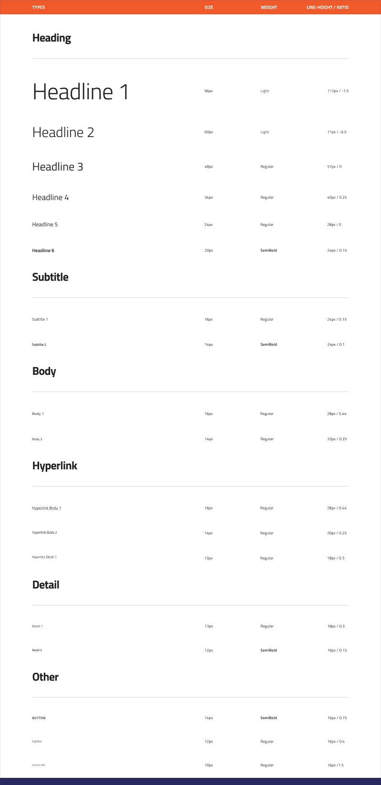

## タイポグラフィ

タイポグラフィを使用してテーマの書体および利用可能なサイズを設定します。[Titillium Web](https://fonts.google.com/specimen/Titillium+Web) をデフォルト書体として使用されますが、デザイナーがアプリケーションをカスタマイズできます。スタイリング ライブラリのタイポグラフィは [Ignite UI for Angular テーマ](https://jp.infragistics.com/products/ignite-ui-angular/angular/components/themes.html)で実装されるタイポグラフィと一致します。



> [!Note]
> コンポーネント ライブラリは Title および Paragraph の [Text](text.md) シンボルを提供します。記事、ブログ投稿の高度なレイアウトの作成で直接にスタイリング ライブラリを使用する代わりにこのアイコンを使用します。タイポグラフィは、デザインのすべてのテキストで一貫性のあるテーマおよびスタイルを定義します。

### タイポグラフィ色

タイポグラフィは `grays.900`、`grays.600`、`white`、`primary`、および `secondary` などのプリセット色があります。`success`、`warn`、および `error` 色の文字列のためのタイポグラフィを含む追加のセットがあり、以下のセクションに説明したコンポーネント固有のバリアントもあります。


### コンポーネント固有のタイポグラフィ

[Avatar](avatar.md)、[Hyperlink](hyperlink.md)、[Text](text.md) などのコンポーネントは仕様のコンポーネント固有のタイポグラフィを使用します。たとえば、Avatar は複数の色を使用し、Hyperlink は下線テキストを使用します。


### 書体の変更

書体を変更するには、`Command` キーを押して、Typography セクション全体にマウスをドラッグします。これはテキスト レイヤーを選択します。(キーを押さない場合、アートボードを選択します。)書体を変更します。すべてのテキスト レイヤーが設定されます。


### タイポグラフィの色の変更

アプリケーションのテーマで `primary` 色および `secondary` 色を更新した後、テキスト色が自動的に更新されないことに注意してください。テキスト色も更新するには、`Command` キーを押して、`primary` または `secondary` セクション全体にマウスをドラッグします。これはテキスト レイヤーを選択します。(キーを押さない場合、アートボードを選択します。)テキスト色を変更します。テーマの必要な色のためにこの手順を繰り返します。


> [!Note]
> 以上の手順で、`grays.600` の代わりに `grays.700` を使用する場合、変更するレイヤーの名前を `Typography/../grays.700` に更新します。

## コードの生成

Sketch 描画に追加されるタイポグラフィ スタイル オブジェクトは相対するテキスト、色、およびサイズの HTML div 要素として描画されます。

### データ バインディング

データ バインディングは波括弧構文によって指定されます。例: {isAdmin}。データ バインディングはネストまたはネストなしが可能です。ターゲット プロパティがネストされたプロパティの場合、ネストされたプロパティ チェーンを含みますがモデル オブジェクト名は含みません。実例:

#### ネストなし

```typescript
Customer {
  imageName: String;
}
```

DataProperty: `{imageName}`

#### ネストあり

```typescript
Profile {
  imageName: String;
}

Customer {
  profile: Profile;
}
```

DataProperty: `{profile.imageName}`

### テキスト

Text プロパティにテキスト、バインディング、または両方を含むことができます。例:

- 設定
- {settingsLabel}
- 重要な {labelText}

## その他のリソース

関連トピック:

- [Avatar](avatar.md)
- [Hyperlink](hyperlink.md)
- [Text](text.md)
  <div class="divider--half"></div>

コミュニティに参加して新しいアイデアをご提案ください。

- [Indigo Design **GitHub** (英語)](https://github.com/IgniteUI/design-system-docfx)
