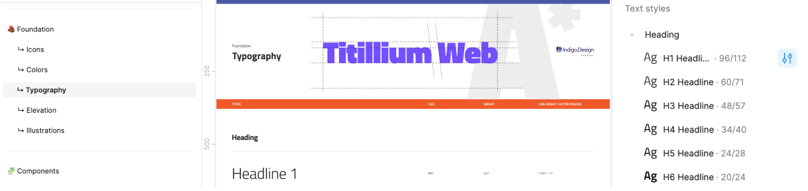

# Typography (タイポグラフィ)

**Indigo.Design システム**には、タイポグラフィを構成し、テーマの書体を設定できる 18 のテキスト (文字) スタイルがあります。デフォルトで [Titillium Web](https://fonts.google.com/specimen/Titillium+Web) を使用していますが、すべてのデザイナーがアプリケーションを柔軟にカスタマイズできるようにする必要があります。Indigo.Design は、[マテリアル タイプ システム](https://material.io/design/typography/the-type-system.html#type-scale)でタイポグラフィが定義されている方法に従い、[Ignite UI for Angular タイポグラフィ](https://jp.infragistics.com/products/ignite-ui-angular/angular/components/themes/typography)の実装に準拠しています。

- **Figma** では、すべてのテキスト スタイルは、**Indigo.Design システム**の `🧱 Foundation` セクションの一部である `↳ Typography` という名前の別のページにあります。これらは、任意のテキスト要素に適用できる `Text Styles` として利用できます。

## Typography のスタイル

プロジェクトでタイポグラフィ システムを使用するには、ライブラリで定義されているテキスト (文字) スタイルの 1 つをネイティブ テキスト要素に適用するだけです。Figma ではサイズ、太さ、行の高さ、比率 (文字間隔) を定義し、配置を調整してカラー スタイルを適用できます。

- タイトルの `H1` から `H6` までの 6 つの見出し。
- 2 つの `Subtitle` サイズ。
- 2 インターフェイスの段落コンテンツの `Body` サイズ。
- 本文のサイズと詳細 1 のサイズに対応した 3 つの `Hyperlink` サイズが用意されており、テキスト内でハイパーリンクを簡単に使用できます。
- グリッド コンポーネントでのみ使用される 2 つの `Detail` サイズ。
- 無料のコンテンツに使用できる `Caption` と `Overline` スタイル。
- Button コンポーネントでのみ使用される `BUTTON` スタイル。

これらのスタイルは、アプリケーションの関連レイヤーに対して生成されるテキスト要素とタイポグラフィ クラスのタイプも決定します。以下の要素は、一般的なテキス トレイヤーに適用されるタイポグラフィ テキスト スタイルに基づいて生成されます。
- 見出しのタイポグラフィ スタイルの見出し `<h1>` から `<h6>`。
- タイポグラフィ クラスの段落 `
`:
  - 2 つの字幕タイポグラフィ スタイルの場合は、`ig-typography__subtitle-1`/`ig-typography__subtitle-2`。
  - 2 つの本体タイポグラフィ スタイルの場合は、`ig-typography__body-1`/`ig-typography__body-2`。
  - 2 つのハイパーリンク タイポグラフィ スタイルの `ig-typography__body-1 hyperlink`/`ig-typography__body-2 hyperlink`。
  - キャプション タイポグラフィ スタイルの場合は `ig-typography__caption`。
  - オーバーライン タイポグラフィ スタイルの場合は `ig-typography__overline`。

記事、ブログ投稿などの高度なレイアウトを作成する場合に使用します。**Indigo.Design システム**の Text Styles は、デザインのすべてのテキストに一貫性のあるテーマとスタイルを定義します。

## コンポーネント固有のタイポグラフィ

[Avatar](../components/avatar.md)、[Button](../components/button.md)、[Grid](../components/grid.md)、[Slider](../components/slider.md) および [Tooltip](../components/tooltip.md) は、コンポーネント固有のタイポグラフィを使用して、それぞれのコンポーネントで使用されるスタイリングの詳細に対応します。たとえば、イニシャル付きの Avatar と Button は大文字のスタイルを使用します。以下に、Sketch で Avatar 用に定義されたテキスト スタイルを示し、フォントのカラーをより多様に使用できるようにします。

## タイポグラフィ & カラー

- **Figma** では、テキスト スタイルにテキスト カラーは含まれていないため、デザインのニーズに基づいて調整できます。

## 書体を変更

### Figma で

スタイルがチーム ライブラリに公開されている場合は、ライブラリ ファイル内のスタイルを編集する必要があります。変更を加えるには、ライブラリ ファイルに対する編集権限が必要です。Titillium Web の書体を別の書体に変更するには、**Indigo.Design システム** ライブラリ ファイルにアクセスする必要があります。デフォルトでは、何も選択していない場合、Figma のスタイルはプロパティ パネルに表示されます。あるいは、`↳ Typography` ページに移動して、すべてのタイポグラフィ スタイルをより包括的に表示し、そこから変更を加えることができます。テキスト スタイルは、キャンバスの右側にあるプロパティ パネルに引き続き表示されます。

 「Edit style」 アイコンをクリックすると、ポップオーバーが開きます。プロパティ セクションにドロップダウンが表示され、別のフォント ファミリを選択できます。すべてのタイポグラフィでこの変更を修正するには、すべてのスタイルに対して同じ手順を個別に実行する必要があることに注意してください。

その後、これらの変更をライブラリの更新として公開する必要があります。サブスクライブしたファイルでこれらの変更を確認するには、変更を確認して受け入れる必要があります。

## カスタム Typography の作成

さまざまなユーザー インターフェイスをデザインするには、タイポグラフィのさまざまなスタイルで十分です。ただし、特別なユース ケースのために追加のスタイルを作成する必要がある場合があります。すべてのプロジェクトに対してグローバルに定義する場合は、Indigo.Designライブラリで定義します。現在のプロジェクトの範囲内でのみ意味のあるものである場合は、代わりにプロジェクト ファイルで実行してください。

### Figma で

テキスト ツール (T) を使用して新しい文字レイヤーを作成し、必要な調整をすべて行ってから、Typography プロパティの Style アイコンをクリックします。タイポグラフィのプロパティは、右側のサイドバーにあります。

レイヤーの調整がすべて完了したら、Style アイコンをクリックし、Create style アイコン (+) を選択します。これによりポップオーバーが開き、新しいテキスト スタイルに名前と説明を付けることができます。必要に応じて、スタイルに追加の変更を適用することもできます。

次に、「Create style」 ボタンをクリックします。これにより、右側のサイドバーのテキスト スタイルに新しいテキスト スタイルがリストされます。最後に、必要に応じてテキスト スタイルの位置を調整して特定のセクションに揃えたり、新しいセクションを作成したりできます。

## その他のリソース

関連トピック:

- [Colors](colors.md)
- [Avatar](../components/avatar.md)
- [Button](../components/button.md)
- [Grid](../components/grid.md)
- [Slider](../components/slider.md)
- [Tooltip](../components/tooltip.md)

コミュニティに参加して新しいアイデアをご提案ください。
